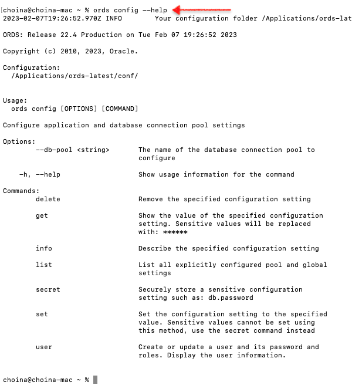
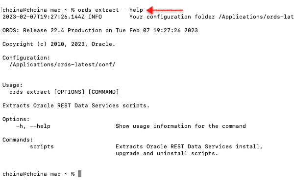
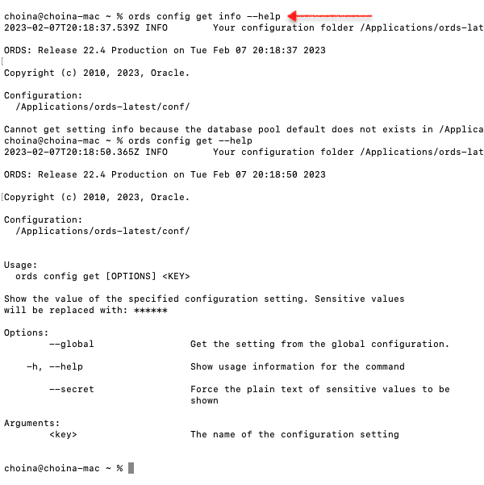

# Appendix 


## 1.2 User Requirements

### ORDS Installer Privileges Script

#### About the script hhhh

> Note: This script is used when you do not want to use SYS AS SYSDBA to install, upgrade, repair, and uninstall ORDS for Oracle PDB or Oracle 11g.

A script file is included in each ORDS download package that provides privileges to a user for ORDS:

- install/uninstall
- upgrade
- repair

The Oracle REST Data Services contains a script, ords_installer_privileges.sql which is located in the scripts/installer folder. The script provides the assigned database user the privileges to install, upgrade, repair, and uninstall ORDS in Oracle Database.
Perform the following steps:

Using SQLcl or SQL*Plus, connect to the Oracle Database instance. You must have a Database account with appropriate privileges for installing ORDS.
    Execute the following script providing the database user:

SQL> @/path/to/scripts/installer/ords_installer_privileges.sql exampleuser
    SQL> exit

You must use the specified database user to install, upgrade, repair, and uninstall ORDS.

> [Return to the Guide](./1-ords-installation-checklist.md#1.2userrequirements)

#### Review Privileges

When the ORDS Installer Privileges script is used, a user is granted equal privileges to install, upgrade, repair, and uninstall ORDS for either/both:

- Oracle Pluggable Database<sup>1</sup>
- Oracle 11g 

<sup>1</sup>Learn about [PDBs](https://docs.oracle.com/en/database/oracle/oracle-database/21/cncpt/introduction-to-oracle-database.html#GUID-ED16D715-761B-4F8B-8503-BC058E216D2F)

> [Return to the Guide](./1-ords-installation-checklist.md#1.2userrequirements)


## 1.3 About the ORDS Command Line tool

### About the ORDS Command Line tool

Beginning in ORDS release 22.1.0 an ORDS Command-Line Interface is included for installation and configuration. This command line interface can be used to:

- Create, update, and list ORDS configurations
- Add additional database pools to your configuration installation/upgrade
- Repair, or uninstall ORDS in the database
- Run ORDS in standalone mode

The preceding functions can be accomplished interactively through prompts, or run silently (non-interactively) using the ORDS commands.

### Basic syntax

Execute a command:

```(shell)
ords <command>
```

Review help and details of a command:

```(shell)
ords <command> --help
```

Review help and details of a command's sub-command:

```(shell)
ords <command> <sub-command> --help
```

### Accessing the ORDS Command Line tool help

The online help provides information about the commands along with the available options and arguments. To show the list of ORDS commands, execute the following command:

```
ords --help
```


*ORDS --help*

To show details and additional help related to an ORDS command, specify the ORDS command followed by `--help`. Two examples can be seen here:


*ORDS config --help*


*ORDS extract --help*

You'll notice "sub-commands" in each of the main commands. For additional details, `--help` after the sub-command; as can be seen here:


*ORDS --help sub-command*

> [Return to the Guide](./1-ords-installation-checklist.md#1.3commandlinetool " ")

## 2.1 Java EE Application Servers

