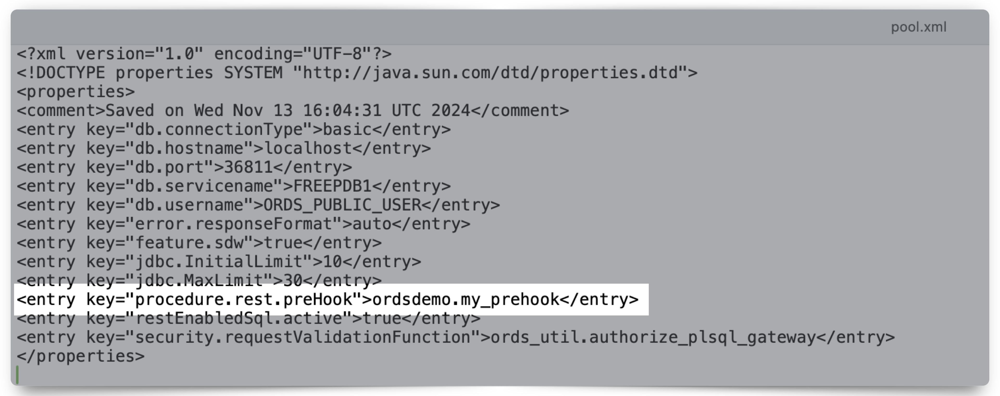
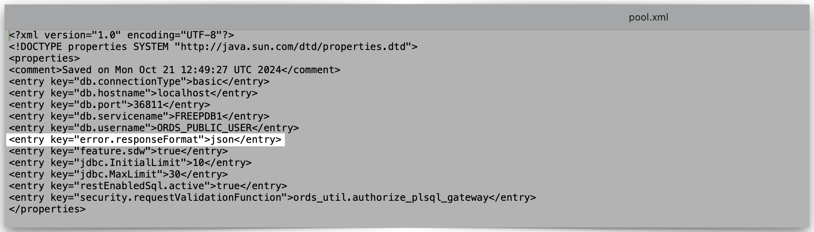

# 2 Developing Oracle REST Data Services Applications

## 2.16 Overview of Pre-hook Functions

This section explains how to use PL/SQL-based pre-hook functions with ORDS. An ORDS pre-hook function is a `BOOLEAN` function that returns a `TRUE` or `FALSE`. Once an ORDS pre-hook function has been defined and configured, the pre-hook function will be invoked prior to satisfying an ORDS `REST` request. The examples contained in this section illustrate several scenarios of how and when an ORDS pre-hook function can be used.

ORDS pre-hook functions are typically used to implement application logic that needs to be applied across all REST endpoints of an application. Pre-hook functions can be used for, but not limited to, scenarios such as:

- Configuring database session-based application context to support a Virtual Private Database (VPD) policy.[^1]
- Customizing authentication and authorization.[^2]
- Enabling auditing or metrics gathering.

[^1]: I'd consider this a rather advanced use case. In this scenario, you would create a PL/SQL package to set an application context (along with a trigger), followed by a function that would permit users to view certain resources (APIs). There is a "simple" tutorial, [here](https://docs.oracle.com/en/database/oracle/oracle-database/19/dbseg/using-oracle-vpd-to-control-data-access.html#GUID-2113CF3C-D950-40B3-A121-A44284EF104D) that details the steps for creating a Virtual Private Database (VPD) policy. However, you do not need to complete the tutorial to understand how something like this would work in practice. If you compare the steps in that tutorial to what is included in the `custom_auth_api.plb` and `custom_auth_api.pls` package body and spec of this ORDS tutorial, you'll notice some parallels. Essentially, you can create some rather novel functions, procedures, and triggers; ones that will be invoked via that ORDS pre-hook `BOOLEAN` (i.e.,  `TRUE / FALSE` ) function. But in the end, *everything* boils down to whether the pre-hook function (and any underlying subprograms) returns either a `TRUE` or `FALSE`. Learn more about "contexts" by reviewing the `SYS_CONTEXT`function in the [SQL Language Reference guide](https://docs.oracle.com/en/database/oracle/oracle-database/21/sqlrf/SYS_CONTEXT.html).

[^2]: In this example, a pre-hook function can be invoked prior to satisfying an ORDS request. Such a pre-hook could (1) inspect the request headers (much like you'll see in this section's `.plb` and `.pls` file contents) (2) identify the user who is making the request, and  (3) determine if that user is authorized to make the request. In fact, you have a lot of options for which environment variables you might want to choose from.  

<details><summary><b>Example:</b> Creating an ORDS <code>GET</code> request to retrieve CGI Environment variables from the <code>PRINT_CGI_ENV</code> PL/SQL utility.</summary>
<p>
For instance, here is a quick way for you to learn some more about ORDS Resource Modules *and* about **C**ommon **G**ateway **I**nterface (CGI) Environment variables as they relate to the Oracle database. We'll rely upon the `OWA_UTIL` PL/SQL package, specifically the [`PRINT_CGI_ENV` procedure](https://docs.oracle.com/en/database/oracle/oracle-database/19/arpls/OWA_UTIL.html#GUID-F9AA35ED-76A8-428B-A7A6-3AEE698B8CE7) (an `HTML utility`; one of three [utility subprograms](https://docs.oracle.com/en/database/oracle/oracle-database/19/arpls/OWA_UTIL.html#GUID-7915F61E-1E50-4507-87FC-7E0ECAE3D41D) in the `OWA_UTIL` package). First, create a Resource Module and Template. Then, when creating a Handler, choose `plsql/block` as the `Source Type` and use the `PRINT_CGI_ENV` procedure in the Handler code. Like this:  

```sql
Begin 
  OWA_UTIL.PRINT_CGI_ENV;
End;
```  

  

Save your code and Handler. From there, either copy and paste this Handler's URI into a new terminal session (if using a tool like a curl), Postman (or a similar testing tool), or simply navigate to the URI in a new browser tab or window. What you'll see are all the CGI Environment variables that are sent back (in an *unauthenticated* server response) to you, a client, or an application. Pretty neat trick, eh?  

Here is an example of the response from an Autonomous Database - Always Free tenancy:  

  

Here is a curl command response from a development configuration (i.e., A locally installed ORDS instance running in Standalone mode and a 23ai database in a Podman container). [Learn more about ORDS and Podman](https://followthecoffee.com/category/podman/):  

  

As you can see, there is a ton of data to work with. This is something to keep in mind if you want to use CGI Environment variables with your ORDS pre-hook (YOU DO NOT HAVE TO, this is just an example!).  

You might want to start small by implementing a security policy using something as simple as the `QUERY_STRING` variable (e.g., your ORDS pre-hook calls upon an underlying function or procedure that uses a Query string as a parameter.)  

Look what happens when I append `?chris` to the end of this URI:  

  

If you take a close look, you can see how simple and automatic this is. Something to think about. Even if you don't care about CGI Environment variables *today*, I guarantee this will come in handy in the future.  


[Return to top](#216-overview-of-pre-hook-functions)  
</p>
</details>

### 2.16.1 Configuring the Pre-hook Function

~~This section describes how to configure a pre-hook function.~~  
Once you have performed the required steps in the database, you'll configure ORDS so that it is "aware" and expecting this *stored* pre-hook function. You can configure the pre-hook function in ORDS with the ORDS CLI command:

```shell
ords config set procedure.rest.preHook [schema where pre-hook function is defined.pre-hook function name]
```


You'll receive confirmation of the new setting in your terminal, but you can also review the settings using the `ords config list --include-defaults` command, as well as reviewing the pool.xml configuration file for the related database pool.




### 2.16.2 Using a Pre-hook Function

~~This section explains how the pre-hook function is used.~~
An ORDS pre-hook PL/SQL function must:

1. have zero arguments
2. return a BOOLEAN value
3. be executable by the database user (the user who is issuing the initial HTTP request) or executable by `PUBLIC`[^7]

[^7]: The original documentation read as follows:
> *"A pre-hook must be a PL/SQL function with no arguments and must return a BOOLEAN value. The function must be executable by the database user to whom the request is mapped. For example, if the request is mapped to an ORDS enabled schema, then that schema must be granted the execute privilege on the pre-hook function (or to PUBLIC)."*

Note:
If Oracle APEX 24.1 or higher is used, then the APEX functional user, APEX_PUBLIC_ROUTER, must be granted execute privilege for its friendly URLs (/r) to be accessible.

If the function returns true, then it indicates that the normal processing of the request must continue. If the function returns false, then it indicates that further processing of the request must be aborted.
ORDS invokes a pre-hook function in an OWA (Oracle Web Agent) that is a PL/SQL Gateway Toolkit environment. This means that the function can introspect the request headers and the OWA CGI environment variables, and use that information to drive its logic. The function can also use the OWA PL/SQL APIs to generate a response for the request (for example, in a case where the pre-hook function needs to abort further processing of the request, and provide its own response).

### 2.16.3 Processing of a Request

The pre-hook function must return true if it determines that the processing of a request must continue. In such cases, any OWA response produced by the pre-hook function is ignored (except for cases as detailed in the section Identity Assertion of a User), and the REST service is invoked as usual.

### 2.16.4 Identity Assertion of a User

This section describes how pre-hook function can make assertions about the identity of the user.
When continuing processing, a pre-hook can make assertions about the identity and the roles assigned to the user who is making the request. This information is used in the processing of the REST service. A pre-hook function can determine this by setting one or both of the following OWA response headers.
• X-ORDS-HOOK-USER: Identifies the user making the request, the value is bound to
the :current_user implicit parameter and the REMOTE_IDENT OWA CGI environment variable.
• X-ORDS-HOOK-ROLES: Identifies the roles assigned to the user. This information is used to determine the authorization of the user to access the REST service. If this header is present then X-ORDS-HOOK-USER must also be present.

Note:
X-ORDS-HOOK-USER and X-ORDS-HOOK-ROLES headers are not included in the response of the REST service. These headers are only used internally by ORDS to propagate the user identity and roles.
Using these response headers, a pre-hook can integrate with the role based access control model of ORDS. This enables the application developer to build rich integrations with third party authentication and access control systems.

### 2.16.5 Aborting Processing of a Request

This section explains how the pre-hook function aborts the processing of a request.
If a pre-hook determines that the processing of the REST service should not continue, then the function must return false value. This value indicates to ORDS that further processing of the request must not be attempted.
If the pre-hook does not produce any OWA output, then ORDS generates a 403 Forbidden error response page. If the pre-hook produces any OWA response, then ORDS returns the OWA output as the response. This enables the pre-hook function to customize the response that client receives when processing of the REST service is aborted.

### 2.16.6 Ensuring Pre-hook is Executable

If a schema cannot invoke a pre-hook function, then ORDS generates a 503 Service Unavailable response for any request against that schema. Since a pre-hook has been configured, it would not be safe for ORDS to continue processing the request without invoking the pre-hook function. It is very important that the pre-hook function is executable by all ORDS enabled schemas. If the pre-hook function is not executable, then the REST services defined in those schemas will not be available.

### 2.16.7 Exceptions Handling by Pre-hook Function

When a pre-hook raises an error condition, for example, when a run-time error occurs, a NO DATA FOUND exception is raised. In such cases, ORDS cannot proceed with processing of the REST service as it would not be secure. ORDS inteprets any exception raised by the pre-hook function as a signal that the request is forbidden and generates a 403 Forbidden response, and does not proceed with invoking the REST service. Therefore, if the pre-hook raises an unexpected exception, it forbids access to that REST service. It is highly recommended that all pre-hook functions must have a robust exception handling block so that any unexpected error conditions are handled appropriately and do not make REST Services unavailable.

### 2.16.8 Pre-hook Function Efficiency

A pre-hook function is invoked for every REST service call. Therefore, the pre-hook function must be designed to be efficient. If a pre-hook function is inefficient, then it has a negative effect on the performance of the REST service call. Invoking the pre-hook involves at least one additional database round trip. It is critical that the ORDS instance and the database are located close together so that the round-trip latency overhead is minimized.

### 2.16.9 Using Pre-hook Function with Protected Resources

ORDS enables the protection of resources with roles and privileges. In cases where:
• A privilege protects a particular resource
• A pre-hook function already exists
ORDS invokes pre-hook functions once the initial request to the target resource has been authorized. If an incoming request fails authorization, ORDS does not invoke a related pre- hook function. Instead, ORDS responds with a 401 Unauthorized Response status code.

See Also:
Configuring Secure Access to RESTful Services

### 2.16.10 Pre-Hook Examples

This section provides some sample PL/SQL functions that demonstrate different ways in which the pre-hook functionality can be leveraged.
Source code for the examples provided in the following sections is included in the unzipped Oracle REST Data Services distribution archive examples/pre_hook/sql sub-folder.

#### 2.16.10.1 Installing the Examples

This section describes how to install the pre-hook examples.

To install the pre-hook examples, execute examples/pre_hook/sql/install.sql script. The following code snippet shows how to install the examples using Oracle SQLcl command line interface:
pre_hook $ cd examples/pre_hook/sql/ sql $ sql system/<password>
SQLcl: Release Release 18.1.1 Production on Fri Mar 23 14:03:18 2018 Copyright (c) 1982, 2018, Oracle. All rights reserved.
Password? (**********?) ******
Connected to:
Oracle Database 12c Enterprise Edition Release 12.2.0.1.0 - 64bit Production
SQL> @install <chosen-password>
• You need to adjust the SQLcl connect string and the user credentials to suit your environment. For these demo scenarios, SQLcl connects to the database with service name orcl.
• <chosen-password> is the password you assigned to the PRE_HOOK_TEST database user. Make a note of this password value for later reference.
• The examples/pre_hook/sql/install.sql command creates the following two databases schemas:
– The PRE_HOOK_DEFNS schema where the pre-hook function is defined along with a database table named custom_auth_users, where user identities are stored. This table is populated with a single user joe.bloggs@example.com, whose password is the value assigned for <chosen-password>.
– The PRE_HOOK_TESTS schema where ORDS based REST services that are used to demonstrate the pre-hooks are defined.

##### 2.16.10.1.1 Example: Denying all Access

The simplest pre-hook is one that unilaterally denies access to any REST Service.
To deny access to any REST service, the function must always return false as shown in the following code snippet:

```sql
create or replace function deny_all_hook return boolean as begin
return false;
end;
/
grant execute on deny_all_hook to public;
```

Where:

• The deny_all_hook pre-hook function always returns false value.
• Execute privilege is granted to all users. So, any ORDS enabled schema can invoke this
function
Configuring ORDS
To enable deny_all_hook pre-hook function, perform the following steps:
1. Locate the folder where the Oracle REST Data Services configuration file is stored.
2. Open the settings.xml file and add:
<entry key="procedure.rest.preHook">pre_hook_defns.deny_all_hook</entry>
3. Save the file.
4. Restart Oracle REST Data Services.
Try it out
The install script creates an ORDS enabled schema and a REST service which can be accessed at the following URL (assuming ORDS is deployed on localhost and listening on port 8080) :
http://localhost:8080/ords/pre_hook_tests/prehooks/user
Access the URL in a browser. You should get a response similar to the following:
403 Forbidden
This demonstrates that the deny_all_hook pre-hook function was invoked and it prevented the
access to the REST service by returning a false value.

##### 2.16.10.1.2 Example: Allowing All Access

Modify the source code of the deny_all_hook pre-hook function to allow access to all REST service requests as shown in the following code snippet:
create or replace function deny_all_hook return boolean as begin
return true; end;
/
Try it out
Access the following test URL in a browser:
http://localhost:8080/ords/pre_hook_tests/prehooks/user

The response should include JSON similar to the following code snippet:
{
"authenticated_user": "no user authenticated"
}

Note:
The REST service executes because the pre-hook function authorized it.

Related Topics
• Identity Assertion of a User
This section describes how pre-hook function can make assertions about the identity of the user.

##### 2.16.10.1.3 Example: Asserting User Identity

The following code snippet demonstrates how the pre-hook function makes assertions about the user identity and the roles they possess:
create or replace function identity_hook return boolean as begin
if custom_auth_api.authenticate_owa then custom_auth_api.assert_identity; return true;
end if;
custom_auth_api.prompt_for_basic_credentials('Test Custom Realm'); return false;
end;
The pre-hook delegates the task of authenticating the user to the custom_auth_api.authenticate_owa function. If the function indicates that the user is authenticated, then it invokes the custom_auth_api.assert_identity procedure to propagate the user identity and roles to ORDS.
Configuring ORDS
To enable pre-hook function, perform the following steps:
1. Locate the folder where the Oracle REST Data Services configuration file is stored.
2. Open the settings.xml file and add:
<entry key="procedure.rest.preHook">pre_hook_defns.identity_hook</entry></ entry>
3. Save the file.
4. Restart Oracle REST Data Services.
Try it out
The install script creates an ORDS enabled schema and a REST service that can be accessed at the following URL (assuming ORDS is deployed on localhost and listening on port 8080):

http://localhost:8080/ords/pre_hook_tests/prehooks/user
In a web browser access the preceding URL.

Note:
The first time you access the URL, the browser will prompt you to enter your credentials. Enter the user name as joe.bloggs@example.com and for the password, use the value you assigned for <chosen-password> when you executed the install script. Click the link to sign in.

In response a JSON document is displayed with the JSON object in it.
{"authenticated_user":"joe.bloggs@example.com"}

#### 2.16.10.2 Uninstalling the Examples

This section explains how to uninstall the examples.
The following code snippet shows how to uninstall the examples:
pre_hook $ cd sql/
sql $ sql system/<password>
SQLcl: Release Release 18.1.1 Production on Fri Mar 23 14:03:18 2018 Copyright (c) 1982, 2018, Oracle. All rights reserved.
Password? (**********?) ******
Connected to:
Oracle Database 12c Enterprise Edition Release 12.2.0.1.0 - 64bit Production
SQL> @uninstall

## 2.18 About HTTP Error Responses

You may configure ORDS to generate HTTP error responses exclusively in `HTML` or `JSON` format (the default setting is "Auto"). You can modify the error response format by issuing the following ORDS CLI commands:

| Format | Command |
| ------ | ------- |
| HTML   | `ords config set error.responseFormat html` |
| JSON   | `ords config set error.responseFormat json` |
| Auto (*default*) | `ords config set error.responseFormat auto`|  

After issuing one of the above commands two things will occur:

1. The ORDS CLI will respond with a message that your configuration setting has been updated.
2. Any `pool.xml` files associated with this ORDS installation will automatically update to reflect the changes.
3. The following images illustrate these changes:
   - HTML  
     
   
   - JSON  
     
     
   - Auto  
     
   

> **NOTE:** Prior to ORDS 20.4, only `HTML` responses were supported. To preserve this backward compatibility, by default (i.e., via the Auto setting), ORDS attempts to automatically determine the best format to render error responses.

### 2.18.1 About the error.responseFormat

The `error.responseFormat` setting is a *global*[^1] setting that supports the following values:

- `HTML` - error responses are returned in `HTML` format.
- `JSON` - error responses are returned in `JSON` format.
- `Auto` (*default setting*) - Automatically determines the most appropriate format for error responses.

You may use the following ORDS command line command to review your existing configuration settings:

```sh
ords config list --include-defaults
```


> [^1]: Global settings are those settings found in the `/[your ORDS configuration folder]/global/settings.xml` file. These settings apply to all ORDS instances, regardless of whether they are installed at the Container database (CDB) or Pluggable database (PDB) level.
>
> **NOTE:** An ORDS best practice is to install ORDS at the *PDB level*. This configuration supports High-Availability, Fast Failover, rolling updates, etc. See our Best Practices page for [more details](https://www.oracle.com/database/technologies/appdev/rest/best-practices/).

#### 2.18.1.1 `HTML` Mode


ORDS will render error responses in `HTML` format when you set the `error.responseFormat` value to `html`. You may use this setting to match the behavior of ORDS 20.3.1 and prior releases. The HTML format displays properly in web browsers. However, the HTML format is verbose for non-human clients and may be challenging to parse. The JSON format may be a better alternative for these applications.

#### 2.18.1.2 `JSON` Mode


ORDS will render error responses in `JSON` format when you set the `error.responseFormat` value to `json`. The `JSON` format complies with the Problem Details for HTTP APIs standard[^2].

While the `JSON` format may not display correctly in browsers and can be challenging for non-technical users to decipher. Meanwhile *it is* terse and straightforward for non-human clients to parse. An exception to this may be in a command line environment; tools such as curl[^3] make inspecting JSON simple.

> [^2]: *Learn more* [RFC 7807 Problem Details for HTTP APIs](https://datatracker.ietf.org/doc/html/rfc7807) 
> [^3]: [Download curl](https://curl.se)

#### 2.18.1.3 Auto Mode


The default value for ORDS' `error.responseFormat` setting is `auto`. When `auto` is selected, ORDS automatically applies rules according to various conditions and returns responses in the appropriate format. The following conditions and their dispositions are below:

##### `HTML`

The `HTML` format will be returned when the client supplies an...

- `Accept` request header where `text/html` is the "most preferred" media type.[^4]
- `Origin` header *and* request method is a `POST` *and* `Content-Type` is `application/x-www-form-urlencoded`.

##### `JSON`

The `JSON` format will be returned when the client supplies an...

- `Accept` request header and `application/json` or `application/problem+json` is the "most preferred" media type.[^4]
- `X-Requested-With` request header.[^5],[^6]
- `User-Agent` header whose value starts with `curl/`.
- `Origin` request header.[^5]
  - ***EXCEPTION:** Responses will be rendered in the `HTML` format when the request method is `POST` and `Content-Type` is `application/x-www-form-urlencoded`.*

> [^4]: [About q-factor weighting](https://developer.mozilla.org/en-US/docs/Web/HTTP/Headers/Accept#directives).
> [^5]: The presence of this header indicates the request was initiated via JavaScript code. Accordingly, `JSON` is the most appropriate response format.
> [^6]: When performing an asynchronous HTTP (Ajax) request, the header `X-Requested-With: XMLHttpRequest` is always added. [See Settings > headers for details](https://api.jquery.com/jQuery.ajax/#jQuery-ajax-settings).

