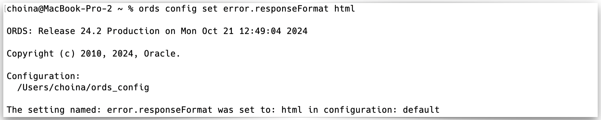
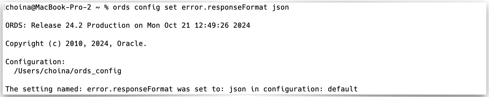
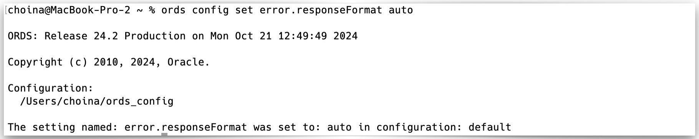
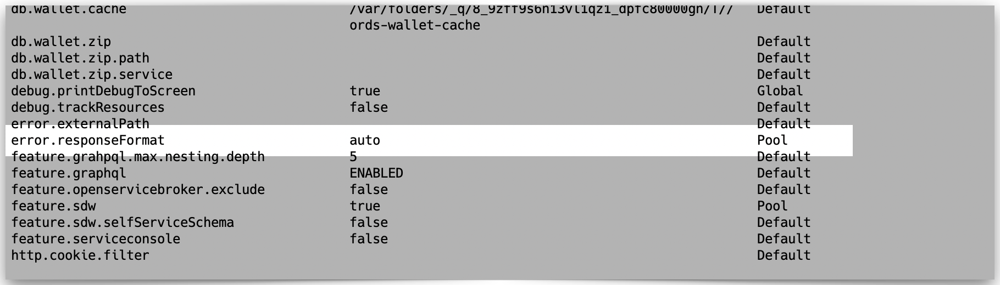

# 2 Developing Oracle REST Data Services Applications

## 2.18 About HTTP Error Responses

You may configure ORDS to generate HTTP error responses exclusively in `HTML` or `JSON` format (the default setting is "Auto"). You can modify the error response format by issuing the following ORDS CLI commands:

| Format | Command |
| ------ | ------- |
| HTML   | `ords config set error.responseFormat html` |
| JSON   | `ords config set error.responseFormat json` |
| Auto (*default*) | `ords config set error.responseFormat auto`|  

After issuing one of the above commands two things will occur:

1. The ORDS CLI will respond with a message that your configuration setting has been updated.
2. Any `pool.xml` files associated with this ORDS installation will automatically update to reflect the changes.
3. The following images illustrate these changes:
   - HTML  
     
   
   - JSON  
     
     
   - Auto  
     
   

> **NOTE:** Prior to ORDS 20.4, only `HTML` responses were supported. To preserve this backward compatibility, by default (i.e., via the Auto setting), ORDS attempts to automatically determine the best format to render error responses.

### 2.18.1 About the error.responseFormat

The `error.responseFormat` setting is a *global*[^1] setting that supports the following values:

- `HTML` - error responses are returned in `HTML` format.
- `JSON` - error responses are returned in `JSON` format.
- `Auto` (*default setting*) - Automatically determines the most appropriate format for error responses.

You may use the following ORDS command line command to review your existing configuration settings:

```sh
ords config list --include-defaults
```


> [^1]: Global settings are those settings found in the `/[your ORDS configuration folder]/global/settings.xml` file. These settings apply to all ORDS instances, regardless of whether they are installed at the Container database (CDB) or Pluggable database (PDB) level.
>
> **NOTE:** An ORDS best practice is to install ORDS at the *PDB leve*l*. This configuration supports High-Availability, Fast Failover, rolling updates, etc. See our Best Practices page for [more details](https://www.oracle.com/database/technologies/appdev/rest/best-practices/).

#### 2.18.1.1 `HTML` Mode


ORDS will render error responses in `HTML` format when you set the `error.responseFormat` value to `html`. You may use this setting to match the behavior of ORDS 20.3.1 and prior releases. The HTML format displays properly in web browsers. However, the HTML format is verbose for non-human clients and may be challenging to parse. The JSON format may be a better alternative for these applications.

#### 2.18.1.2 `JSON` Mode


ORDS will render error responses in `JSON` format when you set the `error.responseFormat` value to `json`. The `JSON` format complies with the Problem Details for HTTP APIs standard[^2].

While the `JSON` format may not display correctly in browsers and can be challenging for non-technical users to decipher. Although *it is* terse and straightforward for non-human clients to parse. An exception to this may be in a command line environment; tools such as curl[^3] make inspecting JSON simple.

> [^2]: *Learn more* [RFC 7807 Problem Details for HTTP APIs](https://datatracker.ietf.org/doc/html/rfc7807) 
> [^3]: [Download curl](https://curl.se)

#### 2.18.1.3 Auto Mode



The default value for ORDS' `error.responseFormat` setting is `auto`. When `auto` is selected, ORDS automatically applies rules according to various conditions and returns responses in the appropriate format. The following conditions and their dispositions are below:

##### `HTML`

The `HTML` format will be returned when the client supplies an...

- `Accept` request header where `text/html` is the "most preferred" media type.[^4]
- `Origin` header *and* request method is a `POST` *and* `Content-Type` is `application/x-www-form-urlencoded`.

##### `JSON`

The `JSON` format will be returned when the client supplies an...

- `Accept` request header and `application/json` or `application/problem+json` is the "most preferred" media type.[^4]
- `X-Requested-With` request header.[^5],[^6]
- `User-Agent` header whose value starts with `curl/`.
- `Origin` request header.[^5]
  - ***EXCEPTION:** Responses will be rendered in the `HTML` format when the request method is `POST` and `Content-Type` is `application/x-www-form-urlencoded`.*

> [^4]: [About q-factor weighting](https://developer.mozilla.org/en-US/docs/Web/HTTP/Headers/Accept#directives).
> [^5]: The presence of this header indicates the request was initiated via JavaScript code. Accordingly, `JSON` is the most appropriate response format.
> [^6]: When performing an asynchronous HTTP (Ajax) request, the header `X-Requested-With: XMLHttpRequest` is always added. [See Settings > headers for details](https://api.jquery.com/jQuery.ajax/#jQuery-ajax-settings).

## ==2.9 JWT Bearer Token Authentication and Authorization Using JWT Profile ( In Process)==

<!-- Still needs work -->
ORDS release 23.3 introduces support for JSON Web Tokens (JWTs). JWT bearer tokens enables ORDS developers to delegate authentication and authorization to any OAuth2-compliant Identity Provider to issue a JWT access token that ORDS can validate to provide access to ORDS protected resources.

ORDS acts as a resource server in a typical OpenID Connect<sup>1</sup> or OAuth2 Code Flow<sup>2</sup>, making it convenient for developers to access ORDS APIs from their web applications.

<sup>1</sup>[OpenID Connect](https://openid.net/developers/how-connect-works/)  
<sup>2</sup>RFC 6750: [The OAuth 2.0 Authorization Framework](https://datatracker.ietf.org/doc/html/rfc6750)  
&nbsp;RCC 6749: [The OAuth 2.0 Authorization Framework: Bearer Token Usage](https://datatracker.ietf.org/doc/html/rfc6749)

You can create a JWT Profile for any REST-Enabled schema to provide ORDS with a mechanism to validate JWT bearer tokens. If a JWT bearer token is validated, then ORDS accepts the following:

- The JWT subject claim as the authenticated user making the request
- The JWT scope claims as the REST-Enabled schemas ORDS privileges that the user has consented to the application using the privileges on their behalf

**Topics:**

2.9.1 About `JSON` Web Tokens (JWTs)  
2.9.2 Prerequisites for JWT Authentication  
2.9.3 Creating an ORDS JWT Profile  
2.9.4 JWT Identity Provider Details  
2.9.5 Making Requests to ORDS Using a JWT Bearer Token

### 2.9.1 About `JSON` Web Tokens (JWTs)

This section introduces you to the `JSON` Web Tokens.

A `JSON` Web Token (JWT) is a compact, URL-safe means of representing claims to be transferred between two parties. The claims in a JWT are encoded as a `JSON` object. ORDS supports the use of any OAuth2-compliant identity providers such as, OCI IAM with Identity Domains, Oracle Identity Cloud Service (IDCS), Auth0, and Okta. If a JWT is required to access a resource, ORDS validates the JWT using a corresponding public verification key provided by the authorization server.

A JWT comprises of the following:
A header, that identifies the type of token and the cryptographic algorithm used to generate the signature.
The header is required to contain the following reserved claims.
Note:A claim is a key value pair, where the key is the name of the claim.
alg (algorithm)
kid (key id)
The header can optionally contain the following reserved claims that ORDS takes into account
x5t (x.509 certificate thumbprint)
typ (type)
The header can also contain custom claims with user-defined names.
A payload containing claims about the identity of the end user, and the properties of the JWT.
A payload is required to contain the following reserved names of the claims:
sub (subject)
aud (audience)
iss (issuer)
iat (issued at)
exp (expiration time)
The payload can optionally contain the following reserved claims that ORDS takes into account
scope or scp
nbf (not before)
A payload can also contain custom claims with user-defined names
A signature, to validate the authenticity of the JWT (derived by base64 encoding the header and the payload).
When using JWTs to control access to the target schema APIs or resources, the JWT Profile in the REST-Enabled schema specifies that the reserved claims in the payload of the JWT must have particular values before ORDS considers the JWT to be valid.

ORDS only accepts the following:

alg (algorithm) values of RS256, RS384 and RS512
kid (key id) value that can be matched to a corresponding public verification key
x5t (x.509 certificate thumbprint) if present to a corresponding public verification key
typ (type) if present, requires the value to be JWT
aud (audience) that matches the target schemas JWT Profile audience
iss (issuer) that matches the target schema JWT Profile issuer
iat (issued at ) identifies the time when the JWT was issued and is not be accepted before this time. This claim is used to determine the age of the JWT and enforce the JWT Profile allowed age if it is set.
exp (expiration time) identifies the expiration time when or after which the JWT is not accepted for processing.
nbf (not before) if present, identifies the time before which the JWT is not accepted for processing.
When a JWT is validated and the payload of JWT contains the scope claim, the ORDS privilege name protecting the resource is verified as being provided in the scope claim before processing.

### 2.9.2 Prerequisites for JWT Authentication

This section lists the prerequisites for JWT authentication.

Before ORDS can accept authentication and authorization using JWTs:

An OAuth2-compliant identity provider (for example, OCI IAM with Identity Domains, Oracle Identity Cloud Service (IDCS), Auth0) must have already been set up to issue JWTs for users who are allowed to access the ORDS resources.
If you want to use custom claims in authorization policies, the identity provider must be set up to add the custom claims to the JWTs that it issues.
See Also:

Managing Applications
Oracle Identity Cloud Service
Auth0, an identity platform to manage access to your applications.
To validate a JWT using a corresponding public verification key provided by the issuing identity provider:

the signing algorithm used to generate the signature of JWT must be one of RS256, RS384, or RS512
the public verification key must have a minimum length of 2048 bits and must not exceed 4096 bits
the public verification key must be specified using the `JSON` Web Key (JWK) format and ORDS can access it without authentication
The JWK URI

The URI must be routable from the subnet containing ORDS
Certain key parameters must be present in the JWKS to verify the signature of the JWT. See Parameters for Verifying JWT Signatures.
By default, the JWKS can be up to 10000 bytes in size

### 2.9.3 Creating an ORDS JWT Profile

This section explains how to create an ORDS JWT Profile.

A JWT Profile can be created within a REST-Enabled schema using the OAUTH.CREATE_JWT_PROFILE procedure. Alternatively, OAUTH_ADMIN.CREATE_JWT_PROFILE can be used to create a JWT Profile in other REST-Enabled schemas as long as the user has the ORDS_ADMINISTRATOR role.

Note:Only one JWT Profile can be defined per schema. To update an existing JWT Profile, the existing JWT Profile must be deleted before creating a new one.
Example:

Copy
BEGIN
OAUTH.CREATE_JWT_PROFILE(
    p_issuer => 'https://identity.oraclecloud.com/',
    p_audience => 'ords/myapplication/api' ,
    p_jwk_url =>'https://idcs-10a10a10a10a10a10a10a10a.identity.oraclecloud.com/admin/v1/SigningCert/jwk'
);
COMMIT;
END;
/
This JWT Profile specifies the issuer, audience, and the JWK URL.

Additionally, an allowed skew and age can be specified. The p_issuer must be a non null value and must match the iss claim in the JWT bearer token. The p_audience must be a non null value and must match with the aud claim in the JWT bearer token.

The p_jwk_url must be a non null value starting with https:// and identify the public verification key provided by the authorization server in a `JSON` Web Key (JWK) format.

Once the JWT Profile has been created, requests made to the schema protected resources can be accessed by providing a valid JWT bearer token with the scope to access the protected resource.
Note:A JWT scope claim is a `JSON` string containing a space-separated list of scopes. A protected ORDS resource is protected with a named ORDS privilege. To access the protected ORDS resource, the JWT scope claim must contain a scope with the same name as the protecting ORDS privilege. The scope of an ORDS privilege are case sensitive.
See Also:

OAUTH PL/SQL Package Reference

### 2.9.4 JWT Identity Provider Details

The identity provider that issued the JWT, determines the values that are allowed to specify for the issuer (iss), and the audience (aud) claims in the JWT. The identity provider that issued the JWT also determines the URI from where to retrieve the `JSON` Web Key Set (JWKS) to verify the signature of the JWT.

Identity Provider	Issuer (iss) claim	Audience (aud) Claim	Format of URI from which to Retrieve the JWKS
Okta	https://<your-okta-tenant-name>.com	
Customer-specific.

The audience configured for the Authorization Server in the Okta Developer Console.
https://<your-okta-tenant-name>.com/oauth2/<auth-server-id> /v1/keys
IDCS	https://identity.oraclecloud.com/	
Customer-specific.

Refer to "Validating Access Tokens" section in Oracle Identity Cloud Service documentation.
https://<tenant-base-url>/admin/v1/SigningCert/jwk

To obtain the JWKS without logging in to Oracle Identity Cloud Service, refer to "Change Default Settings" in Oracle Identity Cloud Service documentation.
OCI IAM with Identity Domains	https://identity.oraclecloud.com	
Customer-specific.

See "Managing Applications" section in OCI IAM with Identity Domains documentation.
https://<tenant-base-url>/admin/v1/SigningCert/jwk
Auth0	https://<your-account-name>.auth0.com/	
Customer-specific.
https://<your-account-name>.auth0.com/.well-known/jwks.json
See Also:

Validating Access Tokens in Oracle Identity Cloud Service documentation.
Change Default Settings in Oracle Identity Cloud Service documentation.
Managing Applications in OCI IAM with Identity Domains documentation.

#### 2.9.4.1 Parameters for Verifying JWT Signatures

This section lists the key parameters required to verify the JWT signatures.

To verify the signature on a JWT, ORDS requires that the key parameters are present in the JWKS returned from an URI.

Key Parameter	Notes
kid	The identifier of the key used to sign the JWT. The value must match the kid claim in the JWT header. For example, master_key.
kty	The type of the key used to sign the JWT. Note that RSA is currently the only supported key type.
n	The public key modulus.
e	The public key exponent.
alg	The signing algorithm (if present) must be set to one of RS256, RS384 or RS512.

#### 2.9.4.2 JWT Scopes and ORDS Privileges

You must configure the identity provider that issued the JWT, so as to provide the scope that matches the desired ORDS privilege. If a resource is protected in ORDS using an ORDS privilege, then that privilege name must be defined as a scope. The scope is then available for the application to request on behalf of the user. The issued JWT must then provide that as a scope claim.

Typically, identity providers allow APIs, resources, or scopes to be defined for a particular audience. For example: ORDS REST-Enabled schema defined API. These APIs, resources, or scopes can then be made available to specific applications or clients. The application can then request access tokens on behalf of an authenticated user for that audience and scope.

More than one scope can be requested and provided in the JWT. The protected ORDS resource is accessible as long as one of the scopes matches the ORDS privilege protecting the resource.

#### 2.9.4.3 JWT Subject

ORDS accepts the subject (sub) claim in a valid JWT bearer token as the unique identifier for the user who consented for the application to access their data.

The value of the subject claim in a valid JWT bearer token is bound to the :current_user implicit parameter and the REMOTE_IDENT OWA CGI environment variable.

### 2.9.5 Making Requests to ORDS Using a JWT Bearer Token

Once a JWT Profile has been created for a REST-Enabled schema, the protected ORDS resources in that schema can be accessed by providing a valid JWT bearer token with the request.

Request to an ORDS protected resource is made from a third party application on behalf of a user. The third party application has configured its authentication using an Identity Provider. The same Identity Provider can be configured to issue JWT access tokens for ORDS. After the third party application has acquired a JWT access token from the Identity Provider, it can include the JWT as a bearer token in requests to ORDS. Third party application can request suitable JWT access tokens with the required scope to access the ORDS resource.

Copy
curl -X GET http://localhost:8080/ords/myapplication/api/sales /  --header "Authorization: Bearer
      $JWT"
