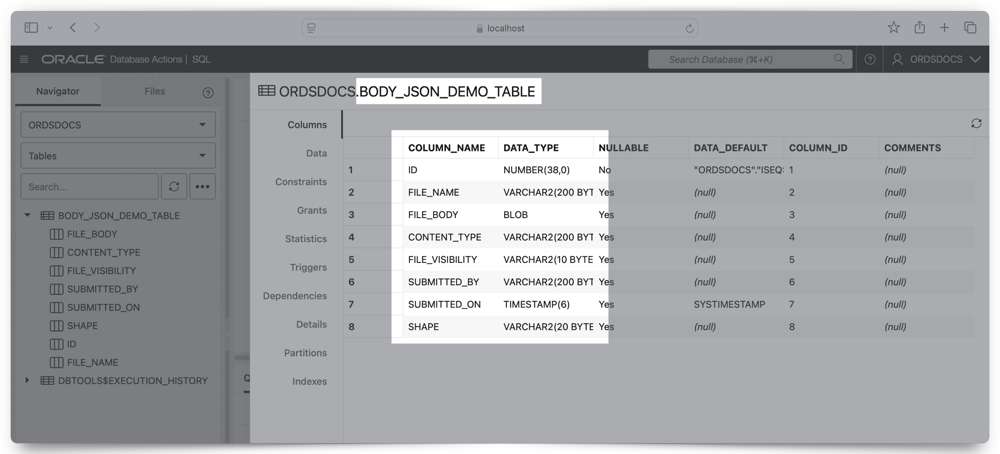
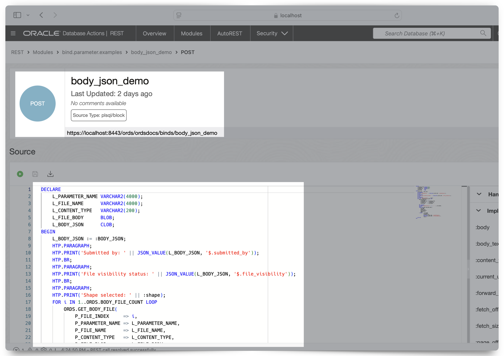
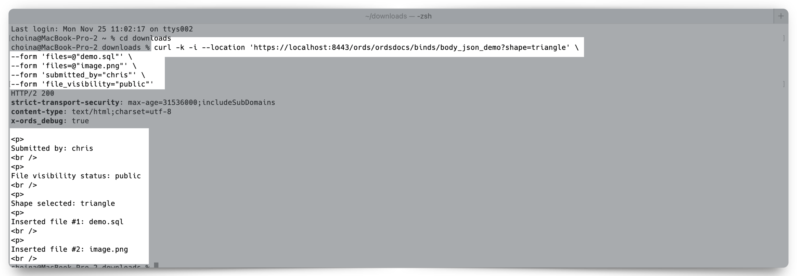
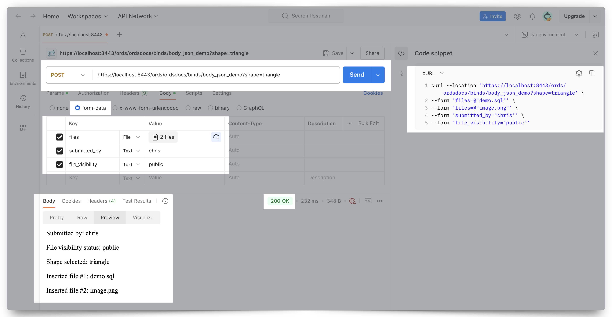
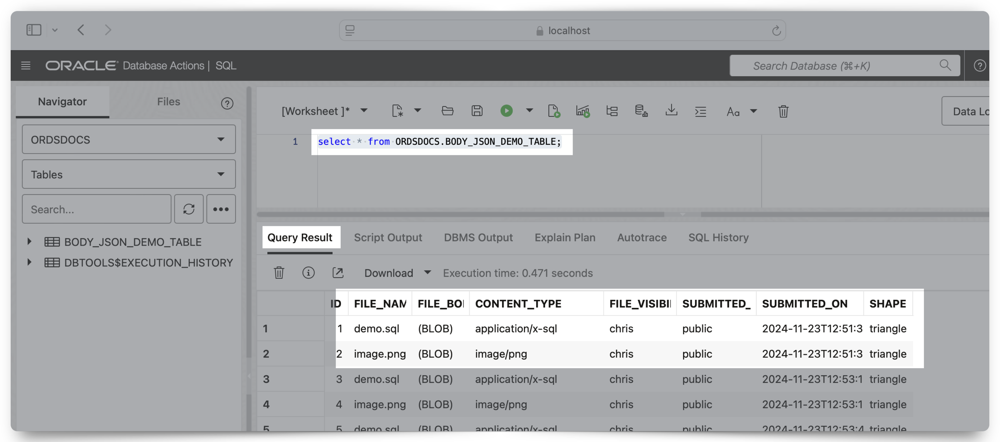

<!-- Example pandoc 3-implicit-parameters.md -f markdown -t docx -o 3-implicit-parameters.md.docx -->

<!-- https://oracle-my.sharepoint.com/personal/tulika_das_oracle_com/_layouts/15/onedrive.aspx?csf=1&web=1&e=7EGLVb&CID=a41001e8%2D3a7e%2D403f%2D9234%2D713d44bb73d6&id=%2Fpersonal%2Ftulika%5Fdas%5Foracle%5Fcom%2FDocuments%2FTD%20Projects%2FORDS%20Doc%20Revamp%202023&FolderCTID=0x0120004335BE87777DC644A1BD73BDB63CA75D&view=0 -->

# 3 Implicit Parameters

This chapter describes the implicit parameters used in REST service handlers that are not explicitly declared. Oracle REST Data Services (ORDS) adds these parameters automatically to Resource Handlers.

## 3.1 List of Implicit Parameters

The following table lists the implicit parameters:

> **Note:** Parameter names are case sensitive. For example, :CURRENT_USER is not a valid implicit parameter.

Table 3-1 List of Implicit Parameters

| Name | Type | Access Mode | HTTP Header | Description | Introduced |
| ---  | ---  | ------      | -------     | -------     | -------    |
| :body | BLOB | IN | N/A | Specifies the body of the request as a temporary BLOB. | 2.0 |
| :body_text | CLOB | IN | N/A | Specifies the body of the request as a temporary CLOB. | 18.3 |
| :body_json | CLOB | IN | N/A | Specifies the body of the request as a temporary CLOB in JSON format. | 24.1 |
| :content_type | VARCHAR |IN | Content-Type | Specifies the MIME type of the request body, as indicated by the Content-Type request header. | 2.0 |
| :current_user | VARCHAR | IN | N/A | Specifies the authenticated user for the request. If no user is authenticated, then the value is set to null. | 2.0 |
| :forward_location | VARCHAR | OUT | X-ORDS-FORWARD-LOCATION | Specifies the location where Oracle REST Data Services must forward a GET request to produce the response for this request. | 18.3 |
| :fetch_offset | NUMBER | IN | N/A | Specifies the zero-based offset of the first row to be displayed on a page. | 18.3 |
| :fetch_size | NUMBER | IN | N/A | Specifies the maximum number of rows to be retrieved on a page. | 18.3 |
| :page_offset | NUMBER | IN | N/A | Specifies the zero based page offset in a paginated request. Note: The :page_offset parameter is deprecated. Use :row_offset parameter instead. | 2.0 |
| :page_size | NUMBER | IN | N/A | Specifies the maximum number of rows to be retrieved on a page. Note: The :page_size parameter is deprecated. Use :fetch_size parameter instead. | 2.0 |
| :row_offset | NUMBER | IN | N/A | Specifies the one-based index of the first row to be displayed in a paginated request. | 3.0 |
| :row_count | NUMBER | IN | N/A | Specifies the one-based index of the last row to be displayed in a paginated request. | 3.0 |
| :status_code | NUMBER | OUT | X-ORDS-STATUS-CODE | Specifies the HTTP status code for the request. | 18.3 |

> **NOTE:** the `:body`, `:body_text`, and `:body_json` parameters are not designed to be used in the *same* Resource Handler. Review the following sections and decide which of these three bind parameters best fits your use case.

### 3.1.1 Automatic binding

ORDS also supports, under various conditions, automatic binding of the following:

- Query parameters (*all conditions*)
- Form data
- JSON objects

When query parameters are provided, they are always automatically bound by Resource Handlers. Whereas automatic binding behavior of form data and `JSON` objects are dependent on the following two factors:

1. Where and how the `:body`, `:body_text`, and `:body_json` implicit parameters are used, *and*
2. The media- or MIME type used:
   - `application/x-www-form-urlencoded`
   - `application/json`
   - `multipart/form-data`
     - *with a single file*
     - *with multiple files*

> **NOTE:** Sections **3.1.1 About the :body parameter**, **3.1.2 About the :body_text parameter**, and **3.1.3 About the :body_json parameter** will cover in detail automatic binding behavior under various conditions.

#### Examples

##### Query Parameters

ORDS supports automatic binding of query parameters for POST requests with all Content Types (i.e., `application/x-www-form-urlencoded,` `application/json,` `multipart/form-data` - *with a single file,* `multipart/form-data` - *with multiple files*).

An HTTP request is issued:

`https://localhost:8443/ords/my_schema/demo/etc?shape=triangle`

The value, `triangle`, would be accessible in an ORDS handler with the automatic bind `:shape`. As can be seen in the example PL/SQL Handler code:

```sql
Begin
  HTP.p('RESULT: ' || :shape);
End;

RESULT: triangle
```

##### Form Data

ORDS supports automatic binding of `POST` request body form data under various conditions. For detailed guidance, refer to the `:body`, `:body_text`, and `:body_json` sections of this document. For illustrative purposes, the following example assumes a `POST` request is being issued to an ORDS Resource Handler with *none* of the previously mentioned "`:body_`" implicit parameters.

An HTTP request is issued (in the form of a curl command):

```sh
curl 'https://localhost:8443/ords/my_schema/demo/etc'
  --header 'Content-Type: application/x-www-form-urlencoded'
  --data-url-encode 'last_name=Ever'
  --data-url-encode 'first_name=Greatest'
```

The values for `last_name` and `first_name` would be accessible in an ORDS handler with the automatic binds `:last_name` and `:first_name`. As can be seen in the example PL/SQL Handler code:

```sql
Begin
  HTP.p('Hello: ' || :first_name || :last_name);
End;

Hello: Greatest Ever
```

> **NOTE:** Refer to the `:body`, `:body_text`, and `:body_json` sections of this document for detailed guidance on when automatic binding of form data can be utilized.

##### JSON items

ORDS supports automatic binding of a JSON object in `POST` requests when the following conditions have been met:

1. The `Content-Type` is of `application/json`, *and*
2. None of the following implicit bind parameters are used in the Resource Handler: `:body`, `:body_text`, `:body_json`.

An HTTP request is issued (in the form of a curl command):

```sh
curl 'https://localhost:8443/ords/my_schema/demo/etc'
  --header 'Content-Type: application/json'
  --data '{username: "clark", "password: "superman1234"}'
```

The values for `username` and `password` would be accessible in this ORDS handler with the automatic binds `:username` and `:password`. As can be seen in the example PL/SQL Handler code:

```sql
Begin
  HTP.p('Hello: ' || :username);
  Htp.p('Your password: ' || :password);
End;

Hello: clark
Your password: superman1234
```

### 3.1.3 About the :body_json parameter

The `:body_json` implicit parameter can be used with `POST` Resource Handlers to receive the contents of a request body as a `JSON` object for `application/x-www-form-urlencoded`, `application/json`, and `multipart/form-data` Content types. This allows Resource Handlers to directly reference JSON properties (i.e., `{"key": "value"}` pairs).[^3.1]

Additionally, the `:body_json` implicit parameter can be used in `multipart/form-data` `POST` requests that *may* include one or more files as well as an accompanying `JSON` object (e.g., as is the case with HTML form data). Form data, bound to the `:body_json` implicit parameter, continues to be received as a `JSON` object while files can be processed with the `ORDS.BODY_FILE_COUNT LOOP` function and the `ORDS.GET_BODY_FILE` procedure.

> [^3.1]: In a scenario such as this, the form data in the `POST` body is sent as a `JSON` object and then handled as a `CLOB` data type in the Oracle database. While *you can* store `JSON` in the Oracle database as `JSON`, `VARCHAR2`, `CLOB`, and `BLOB`, ORDS uses the `CLOB` data type to ensure backward compatibility with earlier releases of the Oracle database.

Similar to the `:body` and `:body_text` implicit parameters, when the `:body_json` implicit parameter is included in a Resource Handler, **it must be invoked and dereferenced**, in order to be used. The `:body_json` parameter can be invoked in various ways. Some examples:

- The `DBMS_OUTPUT` package such as `dbms_output.put_line(:body_json);`
- The hypertext procedures (htp) and functions (htf) packages, such as in `htp.print(:body_json);`
- Assigning the `:body_json` implicit parameter as variable, e.g.`l_body_json := :body_json;`

#### Example

A table (`BODY_JSON_DEMO_TABLE`) has been created with the following attributes:



```sql
CREATE TABLE BODY_JSON_DEMO_TABLE (
    ID              NUMBER(*, 0)
        GENERATED BY DEFAULT AS IDENTITY ( START WITH 1 CACHE 20 )
    NOT NULL,
    FILE_NAME       VARCHAR2(200),
    FILE_BODY       BLOB,
    CONTENT_TYPE    VARCHAR2(200),
    FILE_VISIBILITY VARCHAR2(10),
    SUBMITTED_BY    VARCHAR2(200),
    SUBMITTED_ON    TIMESTAMP DEFAULT SYSTIMESTAMP,
    SHAPE           VARCHAR2(20)
);
```

> **NOTE:** Columns such as `FILE_VISIBILITY`, `SUBMITTED_BY`, and `SUBMITTED_ON` are for *demonstration purposes only*. They are not required.

An ORDS endpoint has been created (with the below Resource Handler code) with the following considerations:

- The endpoint expects multiple files and form data *in a `JSON` format* (i.e., the use of the `:body_json` implicit parameter).
- The `ORDS.BODY_FILE_COUNT` function will be used to count the total files of the `POST` request.
- The `ORDS.GET_BODY_FILE` procedure will be used to temporarily store (in the current database session's memory) file names, details, and contents. Which allows the ORDS Resource Handler to "handle" multiple files in a single `POST` request.



The following Resource Handler code example then performs an `INSERT` on the `BODY_JSON_DEMO_TABLE` and relies upon various HTP procedures to "print" the results to a user, client, or application.

```sql
DECLARE 
    L_PARAMETER_NAME VARCHAR2(4000);
    L_FILE_NAME      VARCHAR2(4000);
    L_CONTENT_TYPE   VARCHAR2(200);
    L_FILE_BODY      BLOB;
    L_BODY_JSON      CLOB;
BEGIN
    L_BODY_JSON := :BODY_JSON;
    HTP.PARAGRAPH;
    HTP.PRINT('Submitted by: ' || JSON_VALUE(L_BODY_JSON, '$.submitted_by'));
    HTP.BR;
    HTP.PARAGRAPH;
    HTP.PRINT('File visibility status: ' || JSON_VALUE(L_BODY_JSON, '$.file_visibility'));
    HTP.BR;
    HTP.PARAGRAPH;
    HTP.PRINT('Shape selected: ' || :shape);
    FOR i IN 1..ORDS.BODY_FILE_COUNT LOOP
        ORDS.GET_BODY_FILE(
            P_FILE_INDEX     => i,
            P_PARAMETER_NAME => L_PARAMETER_NAME,
            P_FILE_NAME      => L_FILE_NAME,
            P_CONTENT_TYPE   => L_CONTENT_TYPE,
            P_FILE_BLOB      => L_FILE_BODY
        );
        HTP.PARAGRAPH;
        HTP.PRINT('Inserted file #' || i || ': ' || L_FILE_NAME);
        HTP.BR;
        INSERT INTO BODY_JSON_DEMO_TABLE (
            FILE_NAME,
            FILE_BODY,
            CONTENT_TYPE,
            FILE_VISIBILITY,
            SUBMITTED_BY,
            SHAPE
        ) VALUES ( L_FILE_NAME,
                   L_FILE_BODY,
                   L_CONTENT_TYPE,
                   JSON_VALUE(L_BODY_JSON, '$.submitted_by'),
                   JSON_VALUE(L_BODY_JSON, '$.file_visibility'),
                   :shape );
    END LOOP;
END;
```

<details><summary>Click to reveal the complete Resource Module.</summary>
<pre><code>
BEGIN
  ORDS.DEFINE_MODULE(
    p_module_name    => 'bind.parameter.examples',
    p_base_path      => '/binds/',
    p_items_per_page => 25,
    p_status         => 'PUBLISHED',
    p_comments       => NULL);

    ORDS.DEFINE_TEMPLATE(
      p_module_name    => 'bind.parameter.examples',
      p_pattern        => 'body_json_demo',
      p_priority       => 0,
      p_etag_type      => 'HASH',
      p_etag_query     => NULL,
      p_comments       => NULL);
      
    ORDS.DEFINE_HANDLER(
      p_module_name    => 'bind.parameter.examples',
      p_pattern        => 'body_json_demo',
      p_method         => 'POST',
      p_source_type    => 'plsql/block',
      p_mimes_allowed  => NULL,
      p_comments       => NULL,
      p_source         => 'DECLARE
                              L_PARAMETER_NAME VARCHAR2(4000);
                              L_FILE_NAME      VARCHAR2(4000);
                              L_CONTENT_TYPE   VARCHAR2(200);
                              L_FILE_BODY      BLOB;
                              L_BODY_JSON      CLOB;
                          BEGIN
                              L_BODY_JSON := :BODY_JSON;
                              HTP.PARAGRAPH;
                              HTP.PRINT(''Submitted by: '' || JSON_VALUE(L_BODY_JSON, ''$.submitted_by''));
                              HTP.BR;
                              HTP.PARAGRAPH;
                              HTP.PRINT(''File visibility status: '' || JSON_VALUE(L_BODY_JSON, ''$.file_visibility''));
                              HTP.BR;
                              HTP.PARAGRAPH;
                              HTP.PRINT(''Shape selected: '' || :shape);
                              FOR i IN 1..ORDS.BODY_FILE_COUNT LOOP
                                  ORDS.GET_BODY_FILE(
                                      P_FILE_INDEX     => i,
                                      P_PARAMETER_NAME => L_PARAMETER_NAME,
                                      P_FILE_NAME      => L_FILE_NAME,
                                      P_CONTENT_TYPE   => L_CONTENT_TYPE,
                                      P_FILE_BLOB      => L_FILE_BODY
                                  );
                                  HTP.PARAGRAPH;
                                  HTP.PRINT(''Inserted file #'' || i || '': '' || L_FILE_NAME);
                                  HTP.BR;
                                  INSERT INTO BODY_JSON_DEMO_TABLE (
                                      FILE_NAME,
                                      FILE_BODY' || ',
                                      CONTENT_TYPE,
                                      FILE_VISIBILITY,
                                      SUBMITTED_BY,
                                      SHAPE
                                  ) VALUES ( L_FILE_NAME,
                                            L_FILE_BODY,
                                            L_CONTENT_TYPE,
                                            JSON_VALUE(L_BODY_JSON, ''$.submitted_by''),
                                            JSON_VALUE(L_BODY_JSON, ''$.file_visibility''),
                                            :shape );
                              END LOOP;
                          END;');

COMMIT;

END;
<code></pre>
</details>

To test this `:body_json` implicit parameter a curl command such as the one below may be used:

> **NOTE:** You may have observed the included query parameter in the above `POST` request. In this example, we illustrate how automatic binding of query parameters (e.g., `shape=triangle` can be used in ORDS `POST` Resource Handlers).

```sh
curl --location 'https://localhost:8443/ords/ordsdocs/binds/body_json_demo?shape=triangle' \
--form 'files=@"demo-3.sql"' \
--form 'files=@"demo-2.sql"' \
--form 'submitted_by="chris"' \
--form 'file_visibility="public"'
```

Accordingly, a client may respond with the following:

```html
<p>
Submitted By: chris
<br />
<p>
File visibility status: public
<br />
<p>
Shape: triangle
<p>
Inserted File: demo-3.sql
<br />
<p>
Inserted File: demo-2.sql
<br />
```



An API testing tool, such as Postman can be used as well:



Querying the target database reveals the updates from these tests:


