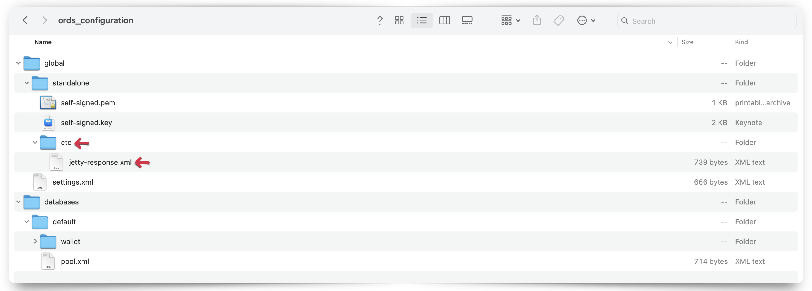

# Miscellaneous Configuration Options of Oracle REST Data Services

## 5.2.3 Using Jetty XML Configuration Files

This section describes how to configure the ORDS Jetty server (i.e., Standalone mode) for additional functionality using Jetty XML configuration files.

When ORDS is in Standalone mode (i.e., relying on the embedded Jetty server as its web server), ORDS can detect and "pick up" user-provided configuration settings found in the `[ORDS configuration directory]/global/standalone/etc` directory.

> **NOTE:** You must create the `[ORDS configuration directory]/global/standalone/etc` directory. The `/etc` directory is not part of the standard ORDS configuration.

If you are familiar with Jetty, then just know that the ORDS `/etc. ` directory is analogous to the `JETTY_BASE` directory, found in a standard Jetty deployment.[^1]

[^1]: It's not crucial for you to have a deep understanding of how Jetty works. At a basic level, just know that there will always be a `JETTY_BASE` as well as a `JETTY_HOME` directory. And, in a standard Jetty installation, `JETTY_BASE` is where your modules and any customization live. While `JETTY_HOME` is where the Jetty binaries live. For the purposes of ORDS, the `[ORDS configuration directory]/global/standalone/etc` directory can be looked at as your `JETTY_BASE`. That is where you'll place `JETTY.XML` files; similar to the ones you'll see in this section's examples. Again, none of this is important for you to know unless, of course, you'd like to learn more about Jetty.

### 5.2.3.1 Jetty Access Logs

> **NOTE:** Beginning with ORDS version 24.1, the standalone ORDS Access Log format was updated to include additional format codes[^2].  
>
> |ORDS versions | Jetty Format codes used  | Access Log example |  
> | --------------- | ------------------- | ------------------ |  
> | 23.4 and earlier | "%h %l %u %t "%r" %s %b" | 127.0.0.1 - frank [10/Oct/2000:13:55:36 -0700] "GET /ords HTTP/1.1" 302 |  
> | 24.1 and later | "%{client}a %u %t "%r" %s %{CLF}O "%{Referrer}i" "%{User-Agent}i" %{ms}T %{Host}i" | 192.168.122.1 - [27/Mar/2023:23:00:07 +0000] "GET /ords/ HTTP/1.1" 302 - "-" "Mozilla/5.0 (X11; Linux x86_64; rv:109.0) Gecko/20100101 Firefox/111.0" 132 192.168.122.149:8080 |  

[^2]: [About Jetty Custom Request Log format codes and syntax](https://javadoc.io/doc/org.eclipse.jetty/jetty-server/10.0.24/org.eclipse.jetty.server/org/eclipse/jetty/server/CustomRequestLog.html)

ORDS Standalone access logs will automatically be enabled once an access log location has been configured. You may enable Standalone logging by executing the following command:

```sh
ords config set standalone.access.log [/Path to the access log location of your choosing]
```


After issuing this configuration command, the ORDS CLI will echo back the location. You can review your configuration settings by executing the `ords config list --include-defaults` command.


You will also see a new `<entry></entry>` has been saved to your `/global/standalone/settings.xml` file in your ORDS configuration folder.


In most cases, the ORDS-provided Access Log data should be sufficient. However, should you choose to create *your own*  custom access log, you may do so with Jetty `XML` files. [^3]

[^3]: Jetty `XML` files can be viewed as a simpler way to add additional configuration settings to your Jetty server without having to create a custom Jetty Module. For a deeper dive into Jetty modules, how to configure them, and customizations [see here](https://jetty.org/docs/jetty/12/operations-guide/modules/index.html).

#### 5.2.3.1.1 Jetty examples

The behavior of the access log will differ depending on your configuration settings. Three possible scenarios for access logs are included.

>**NOTE:** The inclusion of these `XML` files at runtime changes Jetty server behavior and not ORDS behavior.

##### Scenario 1: A `jetty-access-log.xml` file IS included and `standalone.access.log location` IS NOT set

In this first scenario, you do not need to "set" the `standalone.access.log` location. As can be seen in the below image:


*You will*, however, need to create an `/etc` directory in your ORDS configuration folder, similar to how you see below:

```sh
[ORDS configuration directory]/global/standalone/etc
```

An example:


In the above image the `/etc` folder is nested under the `/standalone` folder, the `/standalone` folder is nested under the `/global` folder, and the `/global` folder is nested under the ORDS configuration folder (*your unique configuration folder name and absolute folder paths will differ*).

Place the following `jetty-access-log.xml`[^4] file into that `/etc` folder.


This `jetty-access-log.xml` file is comprised of the following properties:

[^4]: This file can be named `[anything].xml`. The format, contents, and arguments therein are what are important.

```xml
<?xml version="1.0"?>
<!DOCTYPE Configure PUBLIC "-//Jetty//Configure//EN" "http://www.eclipse.org/jetty/configure.dtd">
<Configure id="Server" class="org.eclipse.jetty.server.Server">
    <Ref id="Handlers">
      <Call name="addHandler">
        <Arg>
          <New id="RequestLog" class="org.eclipse.jetty.server.handler.RequestLogHandler">
            <Set name="requestLog">
              <New id="RequestLogImpl" class="org.eclipse.jetty.server.CustomRequestLog">
                <Arg>/Users/choina/ords_access_logs/access.log</Arg>
                <Arg>%{remote}a - %u %t "%r" %s %O "%{Referer}i" "%{User-Agent}i"</Arg>
              </New>
            </Set>
          </New>
        </Arg>
      </Call>
    </Ref>
</Configure>
```

 <sup>*Notice the `<Arg>` tags.*</sup>

Pay special attention to the `<Arg></Arg>` tags. The first *`<Arg>`ument* informs Jetty where and how to save the access log file (i.e., save as `access.log` at the location indicated). The second argument specifies the format strings to include in the log file. For a detailed explanation of these format strings, see the [Jetty Access Logs](#5231-jetty-access-logs) section of this document.

   > **NOTE:** The format strings used in this sample `XML` file were chosen arbitrarily. You can include whatever relevant information, assuming it is available. [See here](https://javadoc.jetty.org/jetty-10/org/eclipse/jetty/server/CustomRequestLog.html) for details.

Once you have saved this file, you may then start ORDS normally (i.e., with the `ords serve` command). ORDS will then save and append Jetty (Standalone) access log information to the `access.log` file. You can later view the results and formatting of this log at the location you specified:


<sup>*An example access log file.*</sup>


<sup>*Reviewing the contents of the access log file.*</sup>

  > **NOTE:** You can remove this file from your ORDS configuration prior to the next time ORDS is started, and it will have no impact on your service.

##### Scenario 2: A `jetty-access-log.xml` file IS included and `standalone.access.log` location IS set

In this scenario, you will have already completed the following two steps:

1. Configured the `standalone.access.log` setting using the ORDS CLI, *and*

     
   <sup>*Configuring the `standalone.access.log` location.*</sup>

     
  <sup>*Verifying the configuration setting with the `ords config list --include-defaults` command.* </sup>

2. You have included a `jetty-access-log.xml` file (or whatever file name of your choosing) in the `/etc` folder.  

   

   > **NOTE:** You will also see a new `<entry></entry>` has been saved to your `/global/standalone/settings.xml` file in your ORDS configuration folder.
   >
   >  

After executing the `ords serve` command, you'll also see the `standalone.access.log` configuration setting included as ORDS initializes.


You'll also notice *two* versions of the access log files in the `/[access log]` folder location.


One file for the `access.log`, which was created from the `jetty-access-log.xml` file you included.  


The other will be a log file with the format of: `ords_[log file date].log`.  


This second file (and subsequent log files saved *by date*), is the one that is automatically created for you as a result of setting the `standalone.access.log` property in your ORDS configuration.[^5]

[^5]: The ORDS-provided access logs, automatically save in the NCSA Common log format. Since other logging applications and tools may *expect* to ingest logs in this format, it might be worth considering whether or not you actually want to customize your own Jetty access logs. You can find details on the NCSA Common log format [here](https://en.wikipedia.org/wiki/Common_Log_Format) or visit the *now-archived* [HTTPd page](https://web.archive.org/web/20081218093425/http://hoohoo.ncsa.uiuc.edu/docs/setup/httpd/Overview.html) for more information on the creation of this format.

##### Scenario 3: A `jetty-access-log.xml` file IS NOT included and `standalone.access.log` location IS set

This is *effectively* the standard, typical way you would configure ORDS for Standalone access logging.

Set the `standalone.access.log` configuration setting with the following command:

```sh
ords config set standalone.access.log [/Path to the access log location of your choosing]
```  


  > **NOTE:** You will also see a new `<entry></entry>` has been saved to your `/global/standalone/settings.xml` file in your ORDS configuration folder.
  >
  > 

Remove any `[jetty].xml` files from your `/etc` folder.


Once you start ORDS (i.e., `ords serve`) you'll find access logs in your `access log` folder.


These and subsequent logs will be saved in the `ords_[log file date].log` format.

##### Considerations

This seems to be the most logical and convenient method for saving Standalone access logs, for a few reasons:

- No need to rely on `XML` files
- Log files are conveniently saved with an intuitive naming convention
- Log files are saved in a recognized format; making it easier for third-party logging analytics tools to ingest the data

### 5.2.3.2 Specifying a header to be returned in every response

> **NOTE:** A Load Balancer or Reverse Proxy can achieve this same result. If your current ORDS deployment consists of either, you may prefer to add header "rules" there instead.
>
>> Should you choose to operate ORDS in Standalone mode, you can rely on the Jetty server to provide this header rule. See the [5.2.3.1.1 Jetty examples](#52311-jetty-examples) section of this guide for configuring the `/etc` folder.
>>
>> 

Once you have created the `/etc` folder, save the following code block as an `XML` file using an easily recognizable file name.  



```xml
<?xml version="1.0"?>
<!DOCTYPE Configure PUBLIC "-//Jetty//Configure//EN" "http://www.eclipse.org/jetty/configure.dtd">
<Configure id="Server" class="org.eclipse.jetty.server.Server">
  <Call name="insertHandler">
  <Arg>
    <New class="org.eclipse.jetty.rewrite.handler.RewriteHandler">
      <Get id="Rewrite" name="ruleContainer" />
      <Call name="addRule">
        <Arg>
          <New id="header"  class="org.eclipse.jetty.rewrite.handler.HeaderPatternRule">
            <Set name="pattern">*</Set>
            <Set name="name">Strict-Transport-Security</Set>
            <Set name="value">max-age=31536000;includeSubDomains</Set>
          </New>
        </Arg>
      </Call>
    </New>
  </Arg>
</Call>
</Configure>
```

In this example, we use `jetty-response.xml` as the file name. With this file included in the `/etc` directory, ORDS will "pick up" this configuration setting during runtime.[^6]

This `jetty-response.xml` file will enable ORDS Standalone to include the `Strict-Transport-Security` header name and its values `max-age=3153600;includeSubDomains` in each request.[^7] In lay terms this XML file establishes a new Jetty response header, named `Strict-Transport-Security`, it applies to all incoming requests (denoted by the `*`), and this header's value is comprised of the following:

- `max-age=31536000;`
- `includeSubDomains`

To illustrate this behavior, consider the following curl command and subsequent response. A request is sent to a resource and the ORDS response includes the `JSON` payload, typical/standard headers, and those indicated in the `jetty-response.xml` file.


Similarly to the Jetty Access Log example, these XML files can be a quick and easy way to introduce additional functionality into your ORDS Stand-Alone deployment.

[^6]: What the hell is runtime? Having no formal education in software engineering, my understanding is that runtime has to do with the execution of a program. Runtime relates to the initial and continued execution of the program. And in the case of these `XML` files, the instructions therein are not formally part of the Jetty server, but are included in the instructions when you issue the `ords serve` command. Doing so effectively starts up the Jetty web server. Jetty then recognizes there are files in the `/etc` folder and includes them when it enters into "runtime" or the "runtime environment." This [Wikipedia post](https://en.wikipedia.org/wiki/Runtime_system) is a great place to start. But I certainly wouldn't use that as the "official" definition. [This stackoverflow thread](https://stackoverflow.com/questions/3900549/what-is-runtime) is extremely helpful as well.

[^7]: `Strict-Transport-Security` ([about this header](https://developer.mozilla.org/en-US/docs/Web/HTTP/Headers/Strict-Transport-Security)) is a [*response* header](https://developer.mozilla.org/en-US/docs/Glossary/Response_header). This header is used to inform the browser that HTTPS should only be used to access ORDS resource/s. You've probably seen `*` used in the ORDS documentation. In this case the `<Set name="pattern">*</Set>` in the XML file is using `*` as a wildcard (i.e. I interpret this as "apply this rule to everything and anything."). The `<Set name="value">max-age=31536000;includeSubDomains</Set>` line includes the "directives": `max-age=3153600;` and `includeSubDomains`. Examples of subdomains would be something like `en.wikipedia.org` where `en` (English language) is a subdomain of `wikipedia.org`; more details [here](https://en.wikipedia.org/wiki/Subdomain).