# Miscellaneous Configuration Options of Oracle REST Data Services

## 5.2.3 Using Jetty XML Configuration Files

This section describes how to configure the ORDS Jetty server (i.e., Standalone mode) for additional functionality using Jetty XML configuration files.

When ORDS is in Standalone mode (i.e., relying on the embedded Jetty server as its web server), ORDS can detect and "pick up" user-provided configuration settings found in the `[ORDS configuration directory]/global/standalone/etc` directory.

> **NOTE:** You must create the `[ORDS configuration directory]/global/standalone/etc` directory. The `/etc` directory is not part of the standard ORDS configuration.

If you are familiar with Jetty, then just know that the ORDS `/etc. ` directory is analogous to the `JETTY_BASE` directory, found in a standard Jetty deployment.[^1]

[^1]: It's not crucial for you to have a deep understanding of how Jetty works. At a basic level, just know that there will always be a `JETTY_BASE` as well as a `JETTY_HOME` directory. And, in a standard Jetty installation, `JETTY_BASE` is where your modules and any customization live. While `JETTY_HOME` is where the Jetty binaries live. For the purposes of ORDS, the `[ORDS configuration directory]/global/standalone/etc` directory can be looked at as your `JETTY_BASE`. That is where you'll place `JETTY.XML` files; similar to the ones you'll see in this section's examples. Again, none of this is important for you to know unless, of course, you'd like to learn more about Jetty.

### 5.2.3.1 Jetty Access Logs

> **NOTE:** Beginning with ORDS version 24.1, the standalone ORDS Access Log format was updated to include additional format codes[^2].  
>
> |ORDS versions | Jetty Format codes used  | Access Log example |  
> | --------------- | ------------------- | ------------------ |  
> | 23.4 and earlier | "%h %l %u %t "%r" %s %b" | 127.0.0.1 - frank [10/Oct/2000:13:55:36 -0700] "GET /ords HTTP/1.1" 302 |  
> | 24.1 and later | "%{client}a %u %t "%r" %s %{CLF}O "%{Referrer}i" "%{User-Agent}i" %{ms}T %{Host}i" | 192.168.122.1 - [27/Mar/2023:23:00:07 +0000] "GET /ords/ HTTP/1.1" 302 - "-" "Mozilla/5.0 (X11; Linux x86_64; rv:109.0) Gecko/20100101 Firefox/111.0" 132 192.168.122.149:8080 |  

[^2]: [About Jetty Custom Request Log format codes and syntax](https://javadoc.io/doc/org.eclipse.jetty/jetty-server/10.0.24/org.eclipse.jetty.server/org/eclipse/jetty/server/CustomRequestLog.html)

ORDS Standalone Access logs will automatically be enabled once an access log location has been configured. You may enable Standalone logging by executing the following command:

```sh
ords config set standalone.access.log [/Path to the access log location of your choosing]
```


After issuing this configuration command, the ORDS CLI will echo back the location. You can review your configuration settings by executing the `ords config list --include-defaults` command.

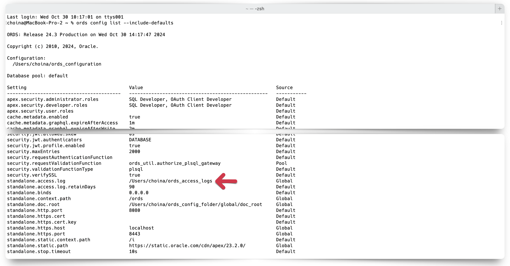

You will also see a new `<entry></entry>` has been saved to your `/global/standalone/settings.xml` file in your ORDS configuration folder.

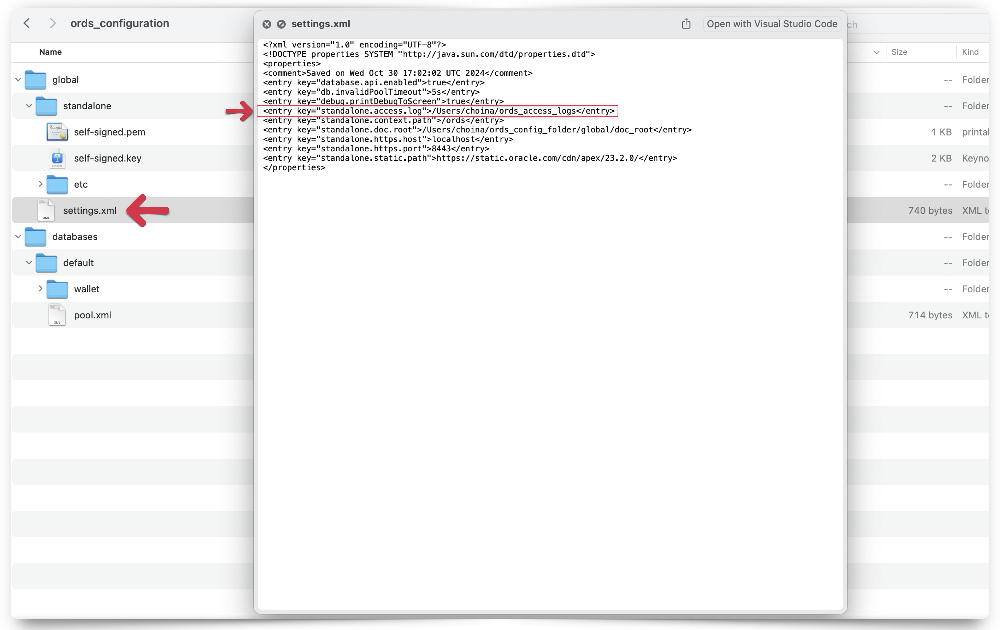

In most cases, the ORDS-provided Access Log data should be sufficient. However, should you choose to create *your own*  custom access log, you may do so with Jetty `XML` files. [^3]

[^3]: Jetty `XML` files can be viewed as a simpler way to add additional configuration settings to your Jetty server without having to create a custom Jetty Module. For a deeper dive into Jetty modules, how to configure them, and customizations [see here](https://jetty.org/docs/jetty/12/operations-guide/modules/index.html).

#### 5.2.3.1.1 Jetty examples

The access log behavior will differ depending on your configuration settings. Below are three possible scenarios for access logs.

>**NOTE:** The inclusion of these `XML` files at runtime changes Jetty server behavior and not ORDS behavior.

##### Scenario 1: a `jetty-access-log.xml` file IS included and `standalone.access.log location` IS NOT set

In this first scenario, you do not need to "set" the `standalone.access.log` location. As can be seen in the below image:


*You will*, however, need to create an `/etc` directory in your ORDS configuration folder, similar to how you see below:

```sh
[ORDS configuration directory]/global/standalone/etc
```

An example:

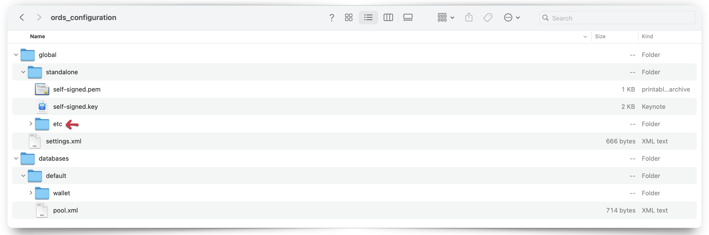

In the above image the `/etc` folder is nested under the `/standalone` folder, the `/standalone` folder is nested under the `/global` folder, and the `/global` folder is nested under the ORDS configuration folder (*your unique configuration folder name and absolute folder paths will differ*).

Place the following `jetty-access-log.xml`[^4] file into that `/etc` folder.

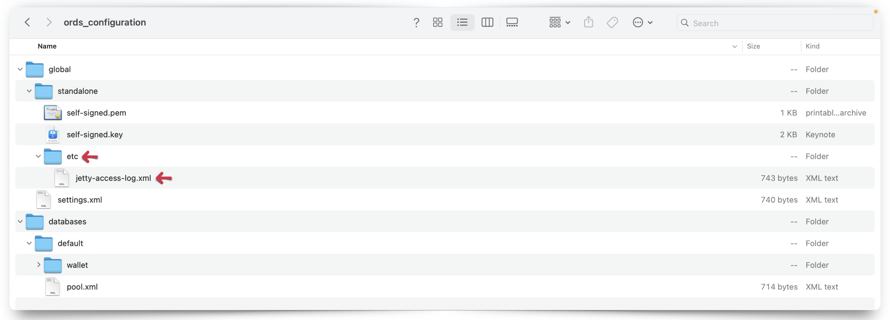

This `jetty-access-log.xml` file is comprised of the following properties:

[^4]: This file can be named `[anything].xml`. The format, contents, and arguments therein are what are important.

```xml
<?xml version="1.0"?>
<!DOCTYPE Configure PUBLIC "-//Jetty//Configure//EN" "http://www.eclipse.org/jetty/configure.dtd">
<Configure id="Server" class="org.eclipse.jetty.server.Server">
    <Ref id="Handlers">
      <Call name="addHandler">
        <Arg>
          <New id="RequestLog" class="org.eclipse.jetty.server.handler.RequestLogHandler">
            <Set name="requestLog">
              <New id="RequestLogImpl" class="org.eclipse.jetty.server.CustomRequestLog">
                <Arg>/Users/choina/ords_access_logs/access.log</Arg>
                <Arg>%{remote}a - %u %t "%r" %s %O "%{Referer}i" "%{User-Agent}i"</Arg>
              </New>
            </Set>
          </New>
        </Arg>
      </Call>
    </Ref>
</Configure>
```

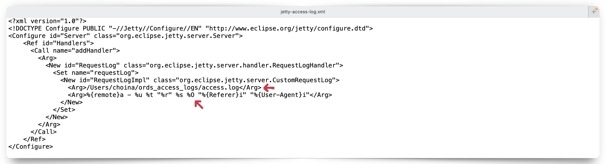

Pay special attention to the `<Arg></Arg>` tags. The first *`<Arg>`ument* informs Jetty where and how to save the access log file (i.e., save as `access.log` at the location indicated). The second argument specifies the format strings to include in the log file. For a detailed explanation of these format strings, see the [Jetty Access Logs](#5231-jetty-access-logs) section of this document.

> **NOTE:** The format strings used in this sample `XML` file were chosen arbitrarily. You can include whatever relevant information, assuming it is available. [See here](https://javadoc.jetty.org/jetty-10/org/eclipse/jetty/server/CustomRequestLog.html) for details.

Once you have saved this file, you may then start ORDS normally (i.e., with the `ords serve` command). ORDS will then save and append Jetty (Standalone) access log information to the `access.log` file. You can later view the results and formatting of this log at the location you specified:

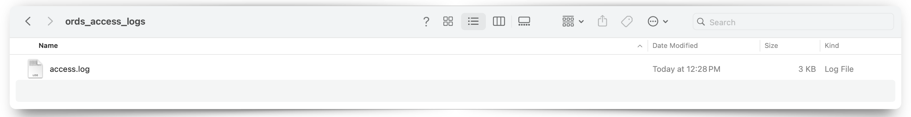
<sup>*An example access log file.*</sup>

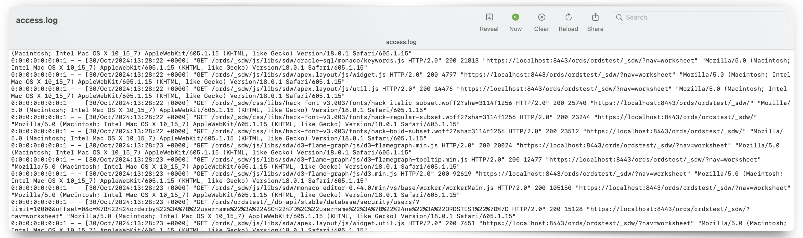
*Reviewing the contents of the access log file.*

> **NOTE:** You can remove this file from your ORDS configuration prior to the next time ORDS is started, and it will have no impact on your service.

**A `jetty-access-log.xml` file IS included and `standalone.access.log location` IS set**

In this scenario you will have already completed the following two steps:

1. Configured the `standalone.access.log` setting using the ORDS CLI, *and*

     
   *Configuring the `standalone.access.log` location.*  

     
   *Verifying the configuration setting with the ords `config list --include-defaults` command.*

   > **NOTE:** You will also see a new `<entry></entry>` has been saved to your `/global/standalone/settings.xml` file in your ORDS configuration folder.

   

2. You have included a `jetty-access-log.xml` file (or whatever file name of your choosing) in the `/etc` folder.  

   

After executing the `ords serve` command, you'll also see the `standalone.access.log` configuration setting included as ORDS initializes.

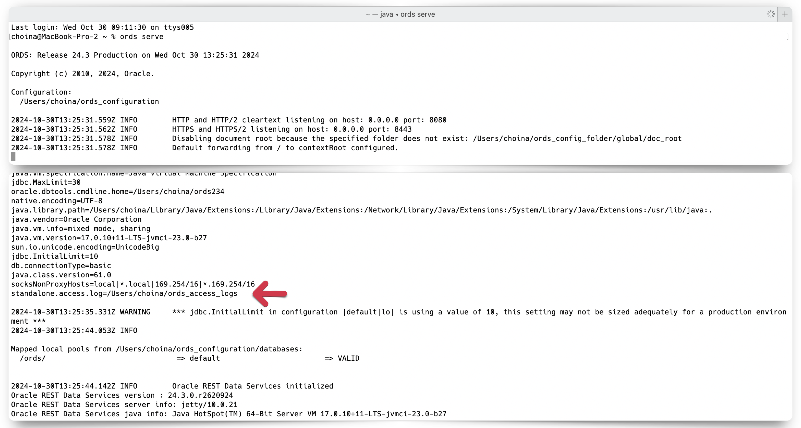

You'll also notice *two* versions of the access log files in the `/[access log]` folder location.

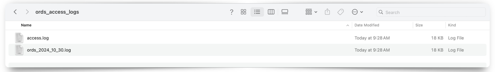

One file for the `access.log`, which was created from the `jetty-access-log.xml` file you included.  

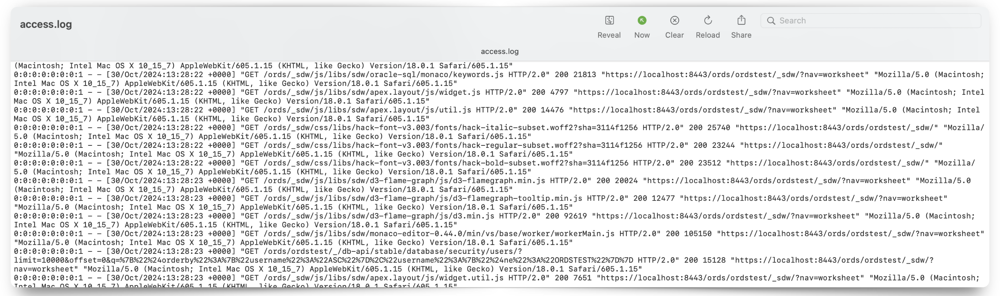

The other will be a log file with the format of: `ords_[log file date].log`.  

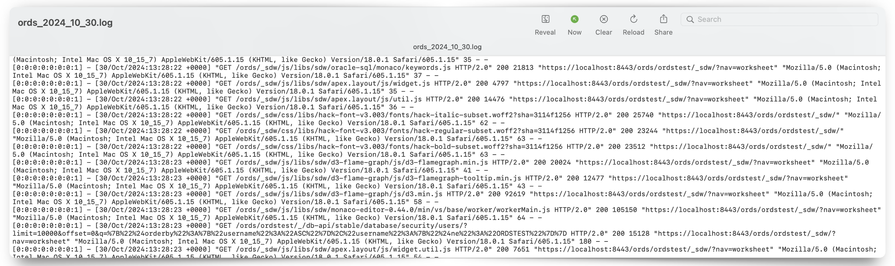

This second file (and subsequent log files saved *by date*), is the one that is automatically created for you as a result of setting the `standalone.access.log` property in your ORDS configuration.[^5]

[^5]: The ORDS-provided access logs, automatically save in the NCSA Common log format. Since other logging applications and tools may *expect* to ingest logs in this format, it might be worth considering whether or not you actually want to customize your own Jetty access logs. You can find details on the NCSA Common log format [here](https://en.wikipedia.org/wiki/Common_Log_Format) or visit the *now-archived* [HTTPd page](https://web.archive.org/web/20081218093425/http://hoohoo.ncsa.uiuc.edu/docs/setup/httpd/Overview.html) for more information on the creation of this format.

**Jetty access log XML file IS NOT included and `standalone.access.log location` IS set**

This is *effectively* the standard, typical way you would configure ORDS for Standalone access logging.

Set the `standalone.access.log` configuration setting with the following command:

```sh
ords config set standalone.access.log [/Path to the access log location of your choosing]
```  


  > **NOTE:** You will also see a new `<entry></entry>` has been saved to your `/global/standalone/settings.xml` file in your ORDS configuration folder.
  >
  > 

Remove and `jetty-access-log.xml` files from your `/etc` folder.

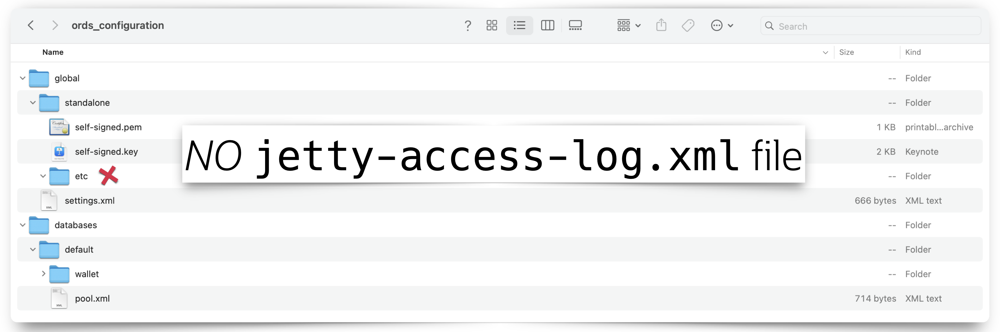

Once you start ords (i.e., `ords serve`) you'll find access logs in your `access log` folder.

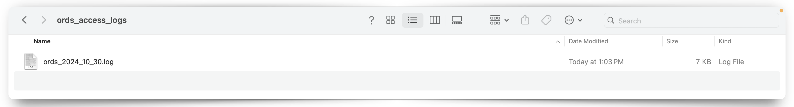

These and subsequent logs will be saved in the `ords_[log file date].log` format.

This seems to be the most logical and convenient method for saving Standalone access logs, for a few reasons:

- No need to rely on XML files
- Log files are conveniently saved with an intuitive naming convention
- Log files are saved in a recognized format; making it easier for third-party logging analytics tools to ingest the data

<!-- #### Example 5-2 Using a specific access log format

When the ORDS `standalone.access.log` configuration setting is set, ORDS access logs are saved to the named location. For instance, the following example sets an access log location at `/user/ords_access_log/access.log`.

*An example access log location setting.*

You can always check ORDS settings by issuing the `ords config list --include-defaults` command.

In this example, you can see that access logs will be saved in the `/ords_access_logs folder`. Setting the access log location will automatically enable access logging.

/global/standalone/etc/jetty-access-log.xml

```xml
<?xml version="1.0"?>
<!DOCTYPE Configure PUBLIC "-//Jetty//Configure//EN" "http://www.eclipse.org/ jetty/configure.dtd">
<Configure id="Server" class="org.eclipse.jetty.server.Server">
<Ref id="Handlers">
<Call name="addHandler">
<Arg>
<New id="RequestLog"
class="org.eclipse.jetty.server.handler.RequestLogHandler"> <Set name="requestLog">
<New id="RequestLogImpl" class="org.eclipse.jetty.server.CustomRequestLog">
<Arg>/ords/ords-access.log</Arg>
<Arg>%{remote}a - %u %t "%r" %s %O "%{Referer}i" "%{User-Agent}i"</Arg> </New>
</Set> </New>
</Arg> </Call>
</Ref> </Configure>
``` -->

<!-- #### Example 5-3 Always returning a certain header in the response

This can also be achieved through a Load Balancer or Reverse Proxy in front of ORDS. If you want a specific header to be returned in every response from the ORDS server. Then use the following sample code snippet:
/global/standalone/etc/jetty-response.xml

```xml
<?xml version="1.0"?>
<!DOCTYPE Configure PUBLIC "-//Jetty//Configure//EN" "http://www.eclipse.org/ jetty/configure.dtd">
<Configure id="Server" class="org.eclipse.jetty.server.Server">
<Call name="insertHandler"> <Arg>
<New class="org.eclipse.jetty.rewrite.handler.RewriteHandler"> <Get id="Rewrite" name="ruleContainer" />
<Call name="addRule">
<Arg>
<New id="header"
class="org.eclipse.jetty.rewrite.handler.HeaderPatternRule"> <Set name="pattern">*</Set>
<Set name="name">Strict-Transport-Security</Set>
<Set name="value">max-age=31536000;includeSubDomains</Set> </New>
</Arg> </Call>
</New> </Arg>
Chapter 5
Configuring Jetty in ORDS Standalone Mode
 Example 5-2 Using a specific access log format
  5-8
</Call> </Configure>
``` -->
