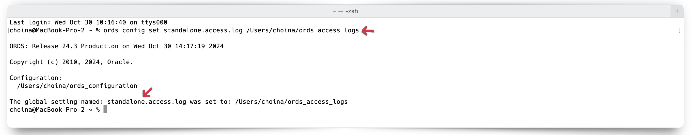

# Miscellaneous Configuration Options of Oracle REST Data Services

## 5.2.3 Using Jetty XML Configuration Files

This section describes how to configure Jetty server for additional functionality using Jetty XML configuration files.

When ORDS is running in Standalone mode (i.e., relying on the embedded Jetty server as its web server), ORDS can detect and "pick-up" user-provided configuration settings found in the `[ORDS configuration directory]/global/standalone/etc` directory.

> **NOTE:** You must create the `[ORDS configuration directory]/global/standalone/etc` directory. The `/etc` directory is not part of the standard ORDS configuration.

If you are familiar with Jetty, then just know that ORDS `/etc` directory is analagous to the `JETTY_BASE` directory, found in a standard Jetty deployment.[^1]

[^1]: Its not crucial for you to understand how Jetty works under the covers. At a basic level just know that: there will always be a `JETTY_BASE` as well as a `JETTY_HOME` directory. In a standard Jetty installation, `JETTY_BASE` are where your modules and any customization lives. While, `JETTY_HOME` are where the Jetty binaries live. For the purposes of ORDS, the `[ORDS configuration directory]/global/standalone/etc` directory can be looked at as your `JETTY_BASE`. That is where all you'll place `JETTY.XML` files, like the ones you see in this section's examples. Again, none of this is important for you to know, unless of course you'd like to learn more about Jetty.

### 5.2.3.1 Jetty Access Logs

> **NOTE:** Beginning with ORDS version 24.1, the standalone ORDS Access Log format was updated to include additional format codes[^2].  
>
> |ORDS versions | Jetty Format codes used  | Access Log example |  
> | --------------- | ------------------- | ------------------ |  
> | 23.4 and earlier | "%h %l %u %t "%r" %>s %b" | 127.0.0.1 - frank [10/Oct/2000:13:55:36 -0700] "GET /ords HTTP/1.1" 302 |  
> | 24.1 and later | "%{client}a %u %t "%r" %s %{CLF}O "%{Referrer}i" "%{User-Agent}i" %{ms}T %{Host}i" | 192.168.122.1 - [27/Mar/2023:23:00:07 +0000] "GET /ords/ HTTP/1.1" 302 - "-" "Mozilla/5.0 (X11; Linux x86_64; rv:109.0) Gecko/20100101 Firefox/111.0" 132 192.168.122.149:8080 |  

[^2]: [About Jetty Custom Request Log format codes and syntax](https://javadoc.io/doc/org.eclipse.jetty/jetty-server/10.0.24/org.eclipse.jetty.server/org/eclipse/jetty/server/CustomRequestLog.html)

ORDS Standalone Access logs will automatically be enabled once an access log location has been configured. You may enable Standalone logging by executing the `ords config set standalone.access.log [/Path to the access log location of your choosing]` command.



After issuing this configuration command, the ORDS CLI will echo back the location. You can also review your configuration settings by executing the `ords config list --include-defaults` command.


In most cases, the ORDS-provided Access Log data should be sufficient. However, should you choose to create your own custom Access Log, you may do so with Jetty `XML` files. [^3]

[^3]: Jetty `XML` files can be viewed as a simpler way to add additional configuration settings to your Jetty server without having to create a custom Jetty Module. For a deeper dive on Jetty modules, how to configuration them, and customizations [see here](https://jetty.org/docs/jetty/12/operations-guide/modules/index.html).

#### 5.2.3.1.1 Jetty examples

The access log behavior will differ depending on different configuration settings. Below are the three scenarios that are possible.

**Jetty access log XML file IS included and `standalone.access.log location` IS NOT set**

In this first scenario, you do not need to set the `standalone.access.log` location. As can be seen in the below image:


*You will* need to create an `/etc` directory in your ORDS configuration folder:

```sh
[ORDS configuration directory]/global/standalone/etc
```

An example can be seen below:


Here the `/etc` folder will be nested under the `/standalone` folder. The `/standalone` folder will be nested under `/global`. And `/global` will be nested under your ORDS configuration folder (*your name and absolute folder path will differ*).

In that folder you will place a `jetty-access-log.xml`[^4] file. Which is comprised of the following:

```xml
<?xml version="1.0"?>
<!DOCTYPE Configure PUBLIC "-//Jetty//Configure//EN" "http://www.eclipse.org/jetty/configure.dtd">
<Configure id="Server" class="org.eclipse.jetty.server.Server">
    <Ref id="Handlers">
      <Call name="addHandler">
        <Arg>
          <New id="RequestLog" class="org.eclipse.jetty.server.handler.RequestLogHandler">
            <Set name="requestLog">
              <New id="RequestLogImpl" class="org.eclipse.jetty.server.CustomRequestLog">
                <Arg>/Users/choina/ords_access_logs/access.log</Arg>
                <Arg>%{remote}a - %u %t "%r" %s %O "%{Referer}i" "%{User-Agent}i"</Arg>
              </New>
            </Set>
          </New>
        </Arg>
      </Call>
    </Ref>
</Configure>
```

Pay special attention to the `<Arg></Arg>` tags. The first *`<Arg>`ument* informs Jetty where and how to save the access log file (i.e., save as `access.log` at the location indicated). The second argument specifies the format strings to include in the log file. For a detailed explantion of these format strings, see the [Jetty Access Logs](#5231-jetty-access-logs) section of this document.

[^4]: This file can be named [anything].xml. The format, contents, and arguments therein are what are important.


**Jetty access log XML file IS included and `standalone.access.log location` IS set**

**Jetty access log XML file IS NOT included and `standalone.access.log location` IS set**

The following section provides an example for customizing the standard Eclipse Jetty Server for additional functionality.

>**NOTE:** The inclusion of these files at runtime change Eclipse Jetty Server behavior and not ORDS behavior.


Prior to creating and saving the below files, you will need to create an `/etc` folder located at:

```sh
[ORDS configuration directory]/global/standalone/etc
```


*An example ORDS `configuration/standalone/etc` folder structure*

#### Example 5-2 Using a specific access log format

When the ORDS `standalone.access.log` configuration setting has been set, ORDS access logs will be saved to the named location. For instance, the following example sets an access log location at `/user/ords_access_log/access.log`.


*An example access log location setting.*

You can always check ORDS settings by issuing the `ords config list --include-defaults` command.


In this example, you can see that access logs will be saved in the `/ords_access_logs folder`. Setting the access log location will automatically enables access logging.

/global/standalone/etc/jetty-access-log.xml

```xml
<?xml version="1.0"?>
<!DOCTYPE Configure PUBLIC "-//Jetty//Configure//EN" "http://www.eclipse.org/ jetty/configure.dtd">
<Configure id="Server" class="org.eclipse.jetty.server.Server">
<Ref id="Handlers">
<Call name="addHandler">
<Arg>
<New id="RequestLog"
class="org.eclipse.jetty.server.handler.RequestLogHandler"> <Set name="requestLog">
<New id="RequestLogImpl" class="org.eclipse.jetty.server.CustomRequestLog">
<Arg>/ords/ords-access.log</Arg>
<Arg>%{remote}a - %u %t "%r" %s %O "%{Referer}i" "%{User-Agent}i"</Arg> </New>
</Set> </New>
</Arg> </Call>
</Ref> </Configure>
```

#### Example 5-3 Always returning a certain header in the response

Although this can also be achieved through a Load Balancer or Reverse Proxy in front of ORDS. If you want a specific header to be returned in every response from the ORDS server. Then use the following sample code snippet:
/global/standalone/etc/jetty-response.xml

```xml
<?xml version="1.0"?>
<!DOCTYPE Configure PUBLIC "-//Jetty//Configure//EN" "http://www.eclipse.org/ jetty/configure.dtd">
<Configure id="Server" class="org.eclipse.jetty.server.Server">
<Call name="insertHandler"> <Arg>
<New class="org.eclipse.jetty.rewrite.handler.RewriteHandler"> <Get id="Rewrite" name="ruleContainer" />
<Call name="addRule">
<Arg>
<New id="header"
class="org.eclipse.jetty.rewrite.handler.HeaderPatternRule"> <Set name="pattern">*</Set>
<Set name="name">Strict-Transport-Security</Set>
<Set name="value">max-age=31536000;includeSubDomains</Set> </New>
</Arg> </Call>
</New> </Arg>
Chapter 5
Configuring Jetty in ORDS Standalone Mode
 Example 5-2 Using a specific access log format
  5-8
</Call> </Configure>
```