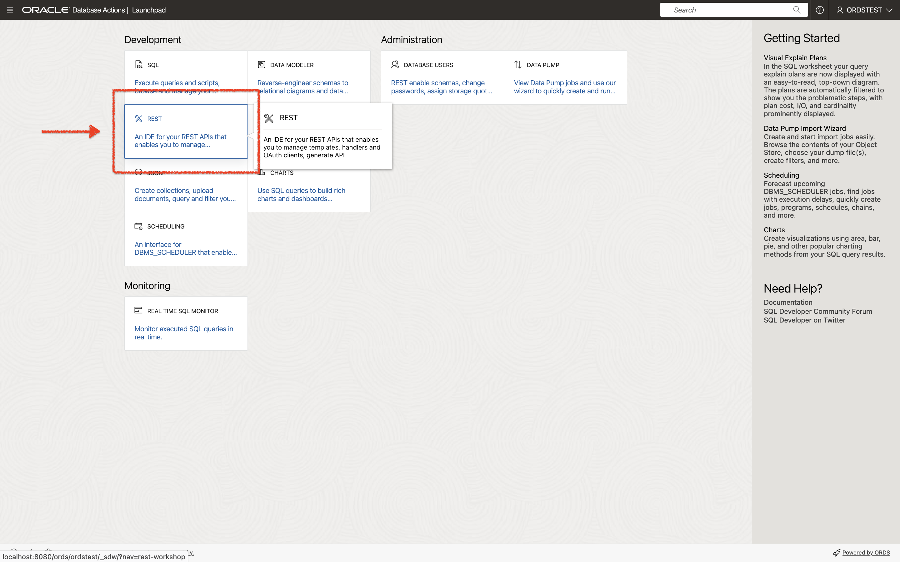
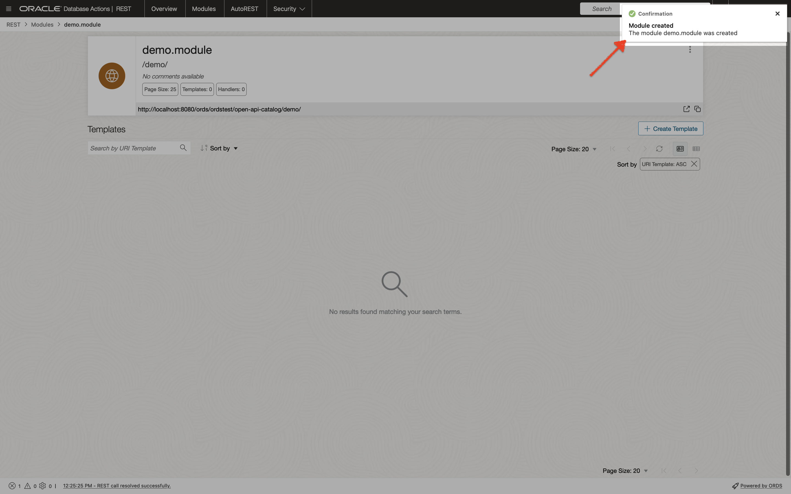
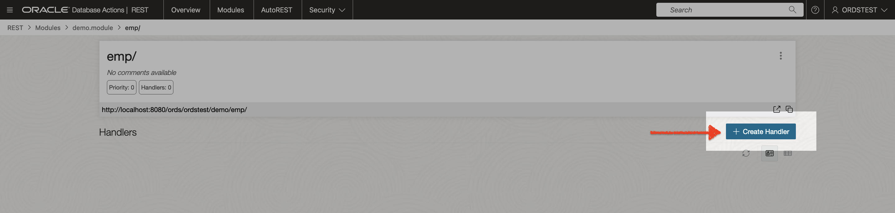
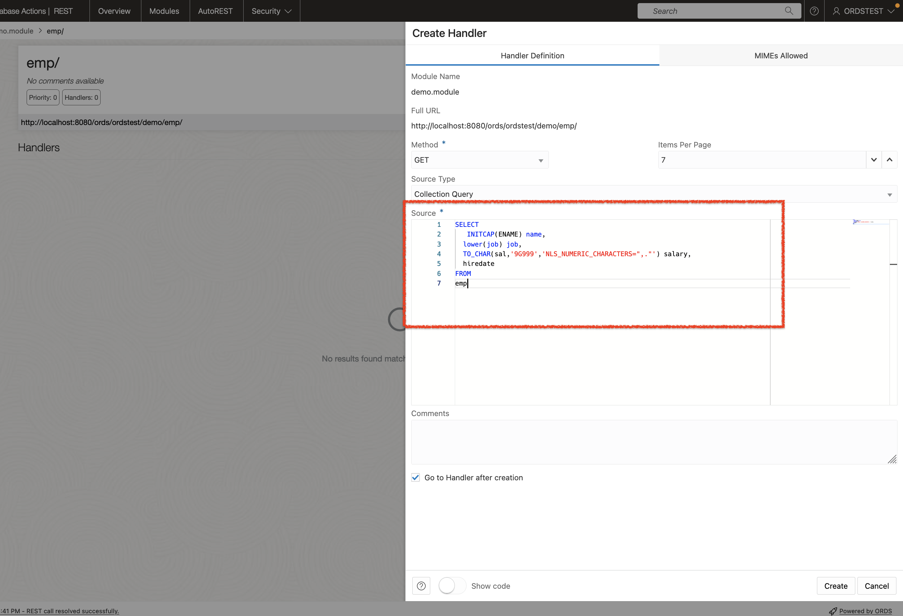
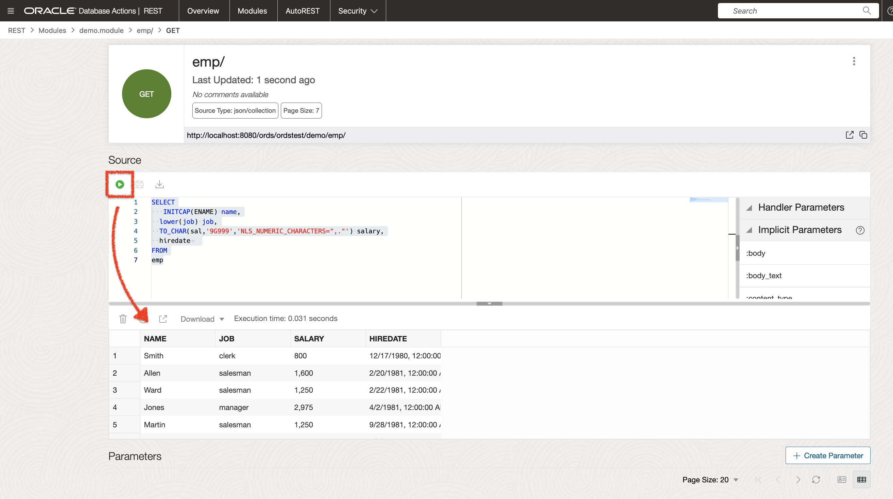

# Oracle REST Data Services Quick Start Guide

## About this tutorial

This tutorial is designed to let you get started quickly developing RESTful services using
Oracle REST Data Services.

## Helpful information

Before you perform the actions in this tutorial, note the following prerequisites and recommendations:

* Ensure that you have Oracle REST Data Services  installed *and* configured for a currently-supported Oracle database
* Ensure that you have installed a currently-supported version of:
  * Oracle SQL Developer
  * SQLcl

> NOTE: The latest version of SQLcl can be obtained [here](https://www.oracle.com/database/sqldeveloper/technologies/sqlcl/download/) *or* through Homebrew with the following `brew install --cask sqlcl` command. Additional SQLcl installation information can be found on [Homebrew](https://formulae.brew.sh/cask/sqlcl#default).

> NOTE: The latest version of Oracle SQL Developer can be obtained [here](https://www.oracle.com/database/sqldeveloper/technologies/download/).

* It is strongly recommended that you install a browser extension that enables you to view
`JSON` in the web browser. Popular browser extensions include:
  * [JSON Formatter](https://chrome.google.com/webstore/detail/json-formatter/bcjindcccaagfpapjjmafapmmgkkhgoa) for Google Chrome
  * [JSONView Add-on](https://addons.mozilla.org/en-US/firefox/addon/jsonview/) for Mozilla Firefox

### This tutorial assumes the following

* Oracle REST Data Services has been installed and configured on the following server, port, and context path: `localhost:8080/ords/`
* Oracle REST Data Services is running in standalone mode
* Oracle REST Data Services installation was performed using a database *Basic Connection* type with the following attributes:

  * Server: `localhost`
  * Port: `1521`
  * Service name:`ORCLPDB1`

>IMPORTANT: The examples in this tutorial assume that Oracle REST Data Services has been installed and configured in a single instance database *or* Pluggable Database (PDB). The examples and images in this guide will refer to the PDB as `ORCLPDB1`.

### Available client applications for this tutorial

The examples in this tutorial can be completed with the choice of your client application:

* SQLcl
* Oracle Database Actions
* Oracle SQL Developer
* Additionally, certain sections of this tutorial will require the use of a web browser.

> NOTE: For a complete list of currently supported web browsers, please refer [here](https://www.oracle.com/middleware/technologies/browser-policy.html).

<!-- #### Oracle SQL Developer

If you are completing this tutorial using Oracle SQL Developer desktop application (_aka_ client), topics covered will include:

1. REST-Enable a Database Table
2. Creating a RESTful Service through the Connections Navigator
3. Creating a RESTful Service from a SQL Query
4. Protect Resources
5. Register an OAuth Client Application

#### Oracle SQLcl

If you are completing this tutorial using the Oracle SQLcl command line application, topics covered with include:

1.
2.
3.
4.
5.
6.

## Using Oracle SQL Developer 

### .....

## Using SQLcl -->

### Getting Started with Oracle RESTful Services

This section will guide you through the following steps:

* Creating a new database user with required roles and privileges for RESTful access
* Creating a new database table
* Inserting data into the newly-created database table
* Creating a *Resource* by auto-REST-enabling the newly-created database table
* Accessing this new Resource via `localhost`

  > NOTE: We recommend you follow the steps in this tutorial as closely as possible, including using the specified names for schemas and database objects. Once you have completed the tutorial as prescribed, feel free to try it again using alternate schema and database object names.

#### Create a new user and REST-enable their schema

1. Using SQLcl, connect to your database as the `SYS` user.

   
   *Logging in with SQLcl as the `SYS` user*

2. Next, create a new `ORDSTEST` user with the following Privileges, Roles, and Tablespace Quota:

   ```sql
   CREATE USER ORDSTEST IDENTIFIED BY <password>;
   GRANT "CONNECT" TO ORDSTEST;
   GRANT "RESOURCE" TO ORDSTEST;
   GRANT UNLIMITED TABLESPACE TO ORDSTEST;
   ```

   
   *Creating the ORDSTEST user with role, privilege, and tablespace quota*

3. Next, execute the `ORDS_ADMIN.ENABLE_SCHEMA` PL/SQL Procedure. This procedure grants the `ORDSTEST` user REST access.

   ```pl/sql
   BEGIN
    ORDS_ADMIN.ENABLE_SCHEMA(
        P_ENABLED => TRUE,
        P_SCHEMA => 'ORDSTEST',
        P_URL_MAPPING_TYPE => 'BASE_PATH',
        P_URL_MAPPING_PATTERN => 'ordstest',
        P_AUTO_REST_AUTH => FALSE
    );
    COMMIT;
   END;
   ```

   
   *Executing the ORDS.ENABLE_SCHEMA PL/SQL Procedure*

> NOTE: The P_URL_MAPPING_PATTERN parameter *must be* lowercase.

> NOTE: Notice how the `P_AUTO_REST_AUTH` parameter is set to `FALSE`. Setting this parameter to FALSE allows any user access to the ORDS metadata catalogue without the need for user authentication.

> TIP: Additional information on the ORDS PL/SQL Package can be found in [this section](https://docs.oracle.com/en/database/oracle/oracle-rest-data-services/23.1/orddg/ORDS-reference.html#GUID-E4476C14-01B1-4EA4-94D3-73B92C8C9AB3) of the Oracle REST Data Services Developer's Guide.

#### Connect as the new user and auto-REST-enable a table

Now that the `ORDSTEST` user schema has been REST-enabled. You may access Database Actions, as the `ORDSTEST` user.

1. Navigate to this URL: `http://localhost:8080/ords/sql-developer`

   
*Navigating to SQL Developer Web*

2. Next, sign in as the `ORDSTEST` user with the username `ORDSTEST` and Password `oracle` (your password may differ). And click the `Sign in` button.

   Once the page loads, you will see the Database Actions Launchpad, as well as the various categories available to the `ORDSTEST` user.

   
   *The Database Actions Launchpad*

<!-- - You may sign out of Database Actions and continue to the next section of this tutorial.  -->

#### Connect as the new user and auto REST-enable a table

> IMPORTANT: The following tasks will be completed as the `ORDSTEST` user.

<!-- 1. Log out as SYS and using SQLcl reconnect as the `ORDSTEST` user. The tutorial uses the following connection string: `+sql ordstest/oracle@localhost:1521/ORCLPDB1+`
+
.Connecting to ORCLPDB1 as the `ORDSTEST` user.
image::connect-as-ordstest-with-sqlcl.png[]  -->
1. From the Database Actions Launchpad, select SQL, under the Development category of the dashboard.

    
    *Navigating to the SQL Worksheet*

2. Once the SQL Worksheet loads, use the SQL below to create the `EMP` table.

   ```sql
   CREATE TABLE EMP (
       EMPNO NUMBER(4,0),
       ENAME VARCHAR2(10 BYTE),
       JOB VARCHAR2(9 BYTE),
       MGR NUMBER(4,0),
       HIREDATE DATE,
       SAL NUMBER(7,2),
       COMM NUMBER(7,2),
       DEPTNO NUMBER(2,0),
       CONSTRAINT PK_EMP PRIMARY KEY (EMPNO)
       );
   ```

3. With the `EMP` table successfully created, insert the following sample data:

    ```sql
    Insert into EMP (EMPNO,ENAME,JOB,MGR,HIREDATE,SAL,COMM,DEPTNO) values
    (7369,'SMITH','CLERK',7902,to_date('17-DEC-80','DD-MON-RR'),800,null,20);
    Insert into EMP (EMPNO,ENAME,JOB,MGR,HIREDATE,SAL,COMM,DEPTNO) values
    (7499,'ALLEN','SALESMAN',7698,to_date('20-FEB-81','DD-MON-RR'),1600,300,30);
    Insert into EMP (EMPNO,ENAME,JOB,MGR,HIREDATE,SAL,COMM,DEPTNO) values
    (7521,'WARD','SALESMAN',7698,to_date('22-FEB-81','DD-MON-RR'),1250,500,30);
    Insert into EMP (EMPNO,ENAME,JOB,MGR,HIREDATE,SAL,COMM,DEPTNO) values
    (7566,'JONES','MANAGER',7839,to_date('02-APR-81','DD-MON-RR'),2975,null,20);
    Insert into EMP (EMPNO,ENAME,JOB,MGR,HIREDATE,SAL,COMM,DEPTNO) values
    (7654,'MARTIN','SALESMAN',7698,to_date('28-SEP-81','DD-MON-RR'),1250,1400,30); 
    Insert into EMP (EMPNO,ENAME,JOB,MGR,HIREDATE,SAL,COMM,DEPTNO) values
    (7698,'BLAKE','MANAGER',7839,to_date('01-MAY-81','DD-MON-RR'),2850,null,30);
    Insert into EMP (EMPNO,ENAME,JOB,MGR,HIREDATE,SAL,COMM,DEPTNO) values
    (7782,'CLARK','MANAGER',7839,to_date('09-JUN-81','DD-MON-RR'),2450,null,10);
    Insert into EMP (EMPNO,ENAME,JOB,MGR,HIREDATE,SAL,COMM,DEPTNO) values
    (7788,'SCOTT','ANALYST',7566,to_date('19-APR-87','DD-MON-RR'),3000,null,20);
    Insert into EMP (EMPNO,ENAME,JOB,MGR,HIREDATE,SAL,COMM,DEPTNO) values
    (7839,'KING','PRESIDENT',null,to_date('17-NOV-81','DD-MON-RR'),5000,null,10);
    Insert into EMP (EMPNO,ENAME,JOB,MGR,HIREDATE,SAL,COMM,DEPTNO) values
    (7844,'TURNER','SALESMAN',7698,to_date('08-SEP-81','DD-MON-RR'),1500,0,30);
    Insert into EMP (EMPNO,ENAME,JOB,MGR,HIREDATE,SAL,COMM,DEPTNO) values
    (7876,'ADAMS','CLERK',7788,to_date('23-MAY-87','DD-MON-RR'),1100,null,20);
    Insert into EMP (EMPNO,ENAME,JOB,MGR,HIREDATE,SAL,COMM,DEPTNO) values
    (7900,'JAMES','CLERK',7698,to_date('03-DEC-81','DD-MON-RR'),950,null,30);
    Insert into EMP (EMPNO,ENAME,JOB,MGR,HIREDATE,SAL,COMM,DEPTNO) values
    (7902,'FORD','ANALYST',7566,to_date('03-DEC-81','DD-MON-RR'),3000,null,20);
    Insert into EMP (EMPNO,ENAME,JOB,MGR,HIREDATE,SAL,COMM,DEPTNO) values
    (7934,'MILLER','CLERK',7782,to_date('23-JAN-82','DD-MON-RR'),1300,null,10);
    commit;
    ```

   
   *Inserting data into the `EMP` table*

4. With the `EMP` table created and populated with data, you will now auto-REST enable it. From the Navigator Panel, right mouse-click on the table name, navigate to `REST`, then click `Enable`.

   
   *Using the Navigator Panel to select `REST` > `Enable`*

   A `REST Enable Object` slider will appear. After inspecting the parameters that have automatically been generated for you, click the `Enable` button located at the bottom of the slider.

   
   *Reviewing the `REST Enable Object` Slider*`

   A message slider will appear, confirming that the `EMP` table has been REST-enabled.

   
   *Confirmation that the `EMP` table has been REST-enabled*

   <!-- > NOTE: Alternatively, t  For this   n a previous step the `+SYS+` user enabled the `+ORDSTEST+` _schema_. However in this step the `+ORDSTEST+` user will now REST-enable the `+EMP+` with the following PL/SQL Procedure:  -->

#### Testing the auto REST-enabled endpoint

1. You can quickly identify database objects that have been auto-REST enabled by looking for the plug icon next to it's name.

   
   *Plug icon indicating a database object has been auto-REST enabled*

   > NOTE: Click you may need to click the `Refresh` button in the Navigator Panel to display this icon.

   
   *Clicking the `Refresh` button to display database objects*

2. You can review and retrieve the REST endpoints for the `EMP` table by right-clicking on the object's name then `REST` then `cURL command`.

   
   *Navigating to the `cURL command` menu item*

3. A slider will appear. You'll notice the various HTTP Methods available to an auto-REST enabled resource.

    * `GET ALL`
    * `GET` Single
    * `POST`
    * `BATCH LOAD`
    * `PUT`
    * `DELETE`

   Copy the URL portion of the `GET ALL` cURL command.

   
   *Copying the `GET ALL` URL from the `cURL command`*

4. Open a new browser tab, paste the URL into the Address Bar, and press Enter on your keyboard.

   
   *Reviewing the results of the `GET ALL` URI in the browser*

5. You will notice a list of the first 25 items in the `EMP` table. Collapsing the `items` array, will reveal other helpful links, automatically included with all auto-REST enabled resources.

   
   *Collapsing `items` to reveal additional, helpful links*

   > NOTE: ORDS automatically sets pagination to 25 results, although this setting can be changed later if required. This configuration falls outside the scope of this Quick Start Guide.

### Creating a RESTful Service through the REST Workshop

This section explains how to create a RESTful service using REST Workshop in Database Actions. The REST Workshop enables you to create and edit RESTful service definitions.

#### Navigating to the REST Workshop

To create and test a RESTful service in the REST Workshop, follow these steps:

1. While logged in as the `ORDSTEST` user, navigate to the Database Actions Launchpad. From there select the `REST`card, located in the Development category.

   
   *Selecting the `REST` card from the Launchpad*

2. Once the REST Workshop screen loads, click the `Modules` widget. A `Modules` dashboard will load. Next, click the `+ Create Module` button, located in the upper right-hand corner of the dashboard.

     
     *Locating the Modules widget*

     
     *Selecting the `+ Create Module` button*

3. A **Create Module** slider will appear. Enter in the following information:

   * **Module Name**: Any desired name for the connection. For example, `demo.module`
   * **URI Prefix**: `/demo/`
   * **Pagination Size**: `25`

     
     *Adding values to the Module fields*

   * In the **Protected by Privilege** field select `Not Protected`.

     
     *Publishing the Module without requiring a Privilege*

4. Click `Create`, your Module settings will be saved, and you'll be taken to the Resource Templates page. Click the `+ Create Template` button.

   
   *Confirmation notification for Module creation*

   
   *Clicking the `Create Template` button*

5. A **Create Template** slider will appear. In the `URI Template` field, enter: `emp/`. For this demonstration, you'll retain the detault settings. Click the `Create` button.

   
   *Entering in the URI `Template`*

6. You'll be automatically taken to the **Create Handler** page. For this tutorial, you will create a `GET` method. Click the `+ Create Handler` button.

   
   *Clicking the `Create Handler` button*

7. A **Create Handler** slider will appear. Verify the following settings:

   * **Method**: `GET`
   * **Items Per Page**: `7`
   * **Source Type**: `Collection Query`

     
     *Verifying fields of the Resource Handler*

8. In the **Source** field, place the following SQL query:

   ```sql
   <copy>
   SELECT
     INITCAP(ENAME) name,
     lower(job) job,
     TO_CHAR(sal,'9G999','NLS_NUMERIC_CHARACTERS=",."') salary,
     hiredate
   FROM
   emp
   </copy> 
   ```
  
   
   *`SQL` query added to the Source field*

9. Click the **Create** button. You'll be taken to the Resource Handler page.

   
   *Confirmation that Resource Handler was created*

10. To test the SQL query you may click the `Play` icon. The results of the query will appear in the output window below.

    
    *Reviewing results of the Handler `SQL` query*

11. To test the RESTful service, click the `Open in a new tab` icon. A new browser tab will appear, with the results from the `GET` method.

    
    *Opening the URI in a new browser tab*

    
    *Reviewing the `JSON` response in the browser window*

#### Creating a Privilege using Database Actions

Controlling access to protected resources is done by defining privileges. Privileges restrict access to only users having at least one of a set of specified roles. A privilege is then associated with one or more resource modules: before those resource modules can be accessed, the user must be authenticated and then authorized to ensure that the user has one of the required roles.  

1. To protect a resource, begin by creating a Privilege. Navigate to the `REST` Workshop.

2. Under the Security menu item, click on Privileges.

3. Then, click the `+ Create Privilege` button. A `Create Privilege` slider will appear.

4. Enter the following for the field values:

   * `Label`: Demo module Privilege
   * `Name`: demo.module.privilege
   * `Description`: A Privilege created for demonstrating privileges for the `demo.module` Resource Module.

5. Next, navigate to the **Protected Modules** tab. Ensure the `demo.module` Resource Module is moved from the available to the column on the right. This ensures that the `demo.module` Resource Module is associated with this Privilege.

Need to 